# Azure Web App Deployment - Manual Steps Guide

A step-by-step guide to deploy a web application to Azure App Service using GitHub Actions with federated credentials (OIDC).

---

## Step 1: Create a Resource Group

**What it is:** A folder in Azure where you keep all your project resources organized in one place.
**How it helps:** Makes it easy to manage everything together and delete all resources at once when you're done.

1. Go to **https://portal.azure.com**
2. In the top search bar, type **Resource groups**
3. Click **Resource groups** from the results
4. Click **+ Create**
5. Fill in:
   - **Subscription:** Select your subscription (e.g., `Azure subscription 1`)
   - **Resource group name:** `rg-kalal`
   - **Region:** `Central US`
6. Click **Review + create**
7. Click **Create**

**Example values:**

- Name: `rg-kalal`
- Region: `Central US`
- Subscription: `Azure subscription 1`

---

## Step 2: Create an App Service Plan

**What it is:** The server power level you choose for your website (like small, medium, or large).
**How it helps:** Free F1 is the cheapest option and works perfectly for learning and testing your app.

1. In the top search bar, type **App Service plans**
2. Click **App Service plans** from the results
3. Click **+ Create**
4. Fill in the **Basics** tab:
   - **Subscription:** Select your subscription
   - **Resource Group:** Select `rg-kalal`
   - **Name:** `plan-kalal`
   - **Operating System:** Select `Linux`
   - **Region:** `Central US`
   - **Pricing plan:** Click **Explore pricing plans** → Select **Free F1** → Click **Select**
5. Click **Review + create**
6. Click **Create**

**Example values:**

- Name: `plan-kalal`
- Resource Group: `rg-kalal`
- OS: Linux
- SKU: Free F1 (shared infrastructure, 60 CPU minutes/day)
- Region: Central US

---

## Step 3: Create an App Service (Web App)

**What it is:** The actual website that runs on Azure and people can visit online.
**How it helps:** It gives your app a web address (like `kalal-java-app.azurewebsites.net`) so users can reach it.

1. In the top search bar, type **App Services**
2. Click **App Services** from the results
3. Click **+ Create** → Select **Web App**
4. Fill in the **Basics** tab:
   - **Subscription:** Select your subscription
   - **Resource Group:** Select `rg-kalal`
   - **Name:** `kalal-java-app` (this becomes your URL: `kalal-java-app.azurewebsites.net`)
   - **Publish:** Select `Code`
   - **Runtime stack:** Select `Java 17`
   - **Java web server stack:** Select `Java SE (Embedded Web Server)`
   - **Operating System:** `Linux`
   - **Region:** `Central US`
   - **Linux Plan:** Select `plan-kalal (F1)`
5. Click **Review + create**
6. Click **Create**
7. Wait for deployment to complete
8. Click **Go to resource**

**Example values:**

- Name: `kalal-java-app`
- URL: `https://kalal-java-app.azurewebsites.net`
- Runtime: Java 17
- Plan: `plan-kalal` (Free F1)

---

## Step 4: Create an App Registration

**What it is:** An identity card for your GitHub workflow so it can log into Azure.
**How it helps:** Lets GitHub access Azure safely without needing to store passwords anywhere.

1. In the top search bar, type **App registrations**
2. Click **App registrations** from the results
3. Click **+ New registration**
4. Fill in:
   - **Name:** `kalal-github-deploy`
   - **Supported account types:** Select `Accounts in this organizational directory only`
   - **Redirect URI:** Leave blank
5. Click **Register**
6. On the Overview page, copy these two values:
   - **Application (client) ID** — example: `1ba7f813-f04a-4df1-bc14-997d883f6654`
   - **Directory (tenant) ID** — example: `a87d418a-4991-4593-b472-b6ede0e96c60`

**Save these values — you will need them later for GitHub secrets.**

---

## Step 5: Create Federated Credentials

**What it is:** A trust link between GitHub and Azure that lets them work together safely.
**How it helps:** GitHub can automatically get permission to deploy your code without needing any passwords.

1. You should be on your App Registration page (`kalal-github-deploy`)
2. In the left sidebar, click **Certificates & secrets**
3. Click the **Federated credentials** tab
4. Click **+ Add credential**
5. For **Federated credential scenario**, select **GitHub Actions deploying Azure resources**
6. Fill in the GitHub details:
   - **Organization:** `kalal-shivakumar`
   - **Repository:** `kalal`
   - **Entity type:** Select `Branch`
   - **GitHub branch name:** `main`
   - **Name:** `github-deploy-main`
7. Verify the auto-generated values at the bottom:
   - Issuer: `https://token.actions.githubusercontent.com`
   - Subject identifier: `repo:kalal-shivakumar/kalal:ref:refs/heads/main`
   - Audience: `api://AzureADTokenExchange`
8. Click **Add**

**Important notes:**

- The **Repository** field must be just `kalal` — NOT the full URL
- The **branch name** must match exactly what your workflow triggers on (`main`)
- Do NOT create a Client Secret — federated credentials replace the need for secrets

---

## Step 6: Assign Contributor Role to the App Registration

**What it is:** Permission that gives your GitHub workflow the right to make changes in Azure.
**How it helps:** Without this, GitHub can't actually deploy your code even if it can log in.

1. In the top search bar, type **Resource groups**
2. Click on `rg-kalal`
3. In the left sidebar, click **Access control (IAM)**
4. Click **+ Add** → **Add role assignment**
5. **Role tab:**
   - Search for `Contributor`
   - Select **Contributor**
   - Click **Next**
6. **Members tab:**
   - For "Assign access to", select **User, group, or service principal**
   - Click **+ Select members**
   - In the search box, type `kalal-github-deploy`
   - Click on it to select it
   - Click **Select**
   - Click **Next**
7. **Review + assign tab:**
   - Click **Review + assign**

**What this does:** Gives the `kalal-github-deploy` identity full permission to manage resources inside `rg-kalal`.

---

## Step 7: Create a GitHub Repository

**What it is:** Your code storage on GitHub where you keep all your files.
**How it helps:** When you upload code here, it automatically starts the deployment to Azure.

1. Go to **https://github.com**
2. Sign in to your account
3. Click the **+** icon (top right) → **New repository**
4. Fill in:
   - **Repository name:** `kalal`
   - **Visibility:** Public (or Private)
   - Do NOT initialize with README (if you already have local code)
5. Click **Create repository**

**Example:**

- Repository URL: `https://github.com/kalal-shivakumar/kalal`
- Default branch: `main`

---

## Step 8: Add Secrets to GitHub Repository

GitHub secrets store your Azure IDs securely so the workflow can use them.

1. Go to your repository: **https://github.com/kalal-shivakumar/kalal**
2. Click **Settings** (tab at the top)
3. In the left sidebar, expand **Secrets and variables**
4. Click **Actions**
5. Click **New repository secret**

**Add these three secrets one at a time:**

**Secret 1:**
- Name: `CLIENTID`
- Secret: paste your Application (client) ID from Step 4
- Example: `1ba7f813-f04a-4df1-bc14-997d883f6654`
- Click **Add secret**

**Secret 2:**
- Name: `TENANTID`
- Secret: paste your Directory (tenant) ID from Step 4
- Example: `a87d418a-4991-4593-b472-b6ede0e96c60`
- Click **Add secret**

**Secret 3:**
- Name: `SUBSCRIPTIONID`
- Secret: paste your Subscription ID (from portal Home → Subscriptions)
- Example: `eea9ffc5-6c64-4dab-b152-3d2f49a73ff1`
- Click **Add secret**

**Where to find Subscription ID:**
1. Go to portal.azure.com
2. Search for **Subscriptions**
3. Click on your subscription
4. Copy the **Subscription ID**

---

## Step 9: Create the GitHub Actions Workflow File

**What it is:** A file that tells GitHub what to do automatically (build and upload your code).
**How it helps:** You don't have to do these steps manually anymore—GitHub does it all automatically.

1. In your project folder, create the directory: `.github/workflows/`
2. Create a file called `deploy.yml` inside it
3. Add this content:

```yaml
name: Deploy to Azure

on:
  push:
    branches: [ main ]
  workflow_dispatch:

permissions:
  id-token: write
  contents: read

jobs:
  deploy:
    runs-on: ubuntu-latest

    steps:
      - uses: actions/checkout@v4

      - name: Set up JDK 17
        uses: actions/setup-java@v4
        with:
          java-version: '17'
          distribution: 'temurin'
          cache: maven

      - name: Build JAR
        run: mvn -B package -DskipTests --file pom.xml

      - name: Login to Azure
        uses: azure/login@v2
        with:
          client-id: ${{ secrets.CLIENTID }}
          tenant-id: ${{ secrets.TENANTID }}
          subscription-id: ${{ secrets.SUBSCRIPTIONID }}

      - name: Deploy to Azure Web App
        uses: azure/webapps-deploy@v3
        with:
          app-name: kalal-java-app
          package: target/*.jar
```

**Key settings explained:**
- `permissions: id-token: write` — required for OIDC authentication
- `workflow_dispatch` — allows you to run the workflow manually from GitHub UI
- `secrets.CLIENTID` — references the secret you added in Step 8

---

## Step 10: Push Code to GitHub

**What it is:** Upload your code to GitHub so it's safe in the cloud.
**How it helps:** As soon as you upload, GitHub starts building and deploying your website automatically.

1. Open terminal/PowerShell in your project folder
2. Run these commands:

```powershell
git init
git add .
git commit -m "Initial commit"
git remote add origin https://github.com/kalal-shivakumar/kalal.git
git branch -M main
git push -u origin main
```

**What happens next:**
- The push to `main` automatically triggers the GitHub Actions workflow
- The workflow builds your Java app and deploys it to Azure

---

## Step 11: Verify the Deployment

**What it is:** Check if your website is live and working correctly on Azure.
**How it helps:** Look at GitHub to see if the deployment succeeded, then visit your website to make sure it works.

**Check GitHub Actions:**
1. Go to **https://github.com/kalal-shivakumar/kalal**
2. Click the **Actions** tab
3. You should see your workflow running (yellow dot) or completed (green checkmark)
4. Click on the run to see detailed logs

**Check your website:**
1. Open browser
2. Go to: **https://kalal-java-app.azurewebsites.net**
3. Your Java website should be live

**If the workflow failed:**
- Click on the failed run
- Read the error message
- Common fixes:
  - Secret names don't match → check spelling in Settings → Secrets
  - Branch name mismatch → federated credential says `main` but you pushed to `master`
  - Missing role assignment → go back to Step 6
  - OIDC error → check federated credential in Step 5

---

## Summary

| Step | What you created | Where |
|------|-----------------|-------|
| 1 | Resource Group (`rg-kalal`) | Azure Portal |
| 2 | App Service Plan (`plan-kalal`) | Azure Portal |
| 3 | Web App (`kalal-java-app`) | Azure Portal |
| 4 | App Registration (`kalal-github-deploy`) | Azure Portal |
| 5 | Federated Credential (`github-deploy-main`) | Azure Portal |
| 6 | Contributor Role Assignment | Azure Portal |
| 7 | GitHub Repository (`kalal`) | GitHub |
| 8 | GitHub Secrets (3 secrets) | GitHub |
| 9 | Workflow file (`deploy.yml`) | Local + GitHub |
| 10 | Push code | Local terminal |
| 11 | Verify deployment | Browser |

---

## Cleanup (Delete Everything)

**Delete Azure resources:**
1. Search **Resource groups** → Click `rg-kalal` → Click **Delete resource group** → Type the name to confirm → Click **Delete**

**Delete App Registration:**
1. Search **App registrations** → Click `kalal-github-deploy` → Click **Delete** → Click **Delete** to confirm

**Delete GitHub repo (optional):**
1. Go to repo **Settings** → Scroll to bottom → **Delete this repository**

---

# HTML Web App - Azure App Service Deployment with GitHub Actions

A simple HTML web application deployed to Azure App Service using GitHub Actions with OIDC (OpenID Connect) federated credentials for passwordless authentication.

---

## Architecture Overview

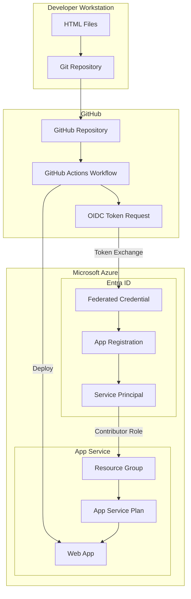

---

## Deployment Flow

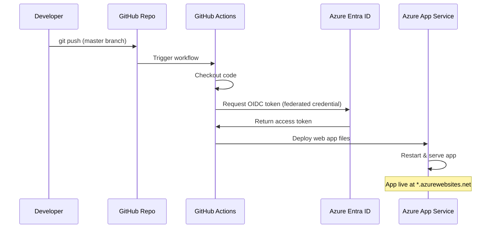

---

## Prerequisites

- [Git](https://git-scm.com/downloads) installed
- [Azure CLI](https://learn.microsoft.com/en-us/cli/azure/install-azure-cli) installed and logged in
- [GitHub CLI (gh)](https://cli.github.com/) installed and authenticated
- An active Azure subscription
- A GitHub account

---

## Stage 1: Create Project Folder and HTML Files

**What it is:** The HTML and CSS files on your computer that make up your website.
**How it helps:** These are the files that get uploaded to Azure to become your live website.

### What this does
Creates the project directory and a basic HTML file that will be served by Azure App Service.

### Manual Steps
1. Create a new folder for the project
2. Create an `index.html` file with basic HTML content

### Commands

```powershell
# Create project directory
mkdir C:\Users\P9202728\HTML-WebApp
cd C:\Users\P9202728\HTML-WebApp
```

### File: `index.html`

```html
<!DOCTYPE html>
<html>
<head>
    <title>Hello World</title>
</head>
<body>
    <h1>Hello World! 🚀</h1>
    <p>Deployed on Azure App Service</p>
</body>
</html>
```

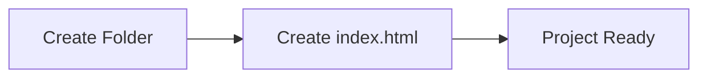

---

## Stage 2: GitHub Repository Creation & Git Commands

**What it is:** Save your code to GitHub with a history of all changes.
**How it helps:** This also triggers the automatic deployment process when you upload code.

### What this does
Initializes a local Git repository, commits the code, creates a remote GitHub repository, and pushes the code.

### Manual Steps
1. Initialize Git in the project folder
2. Stage all files
3. Create initial commit
4. Create a GitHub repository using `gh` CLI
5. Push code to GitHub

### Commands

```powershell
# Initialize git repository
git init

# Stage all files
git add .

# Create initial commit
git commit -m "Initial commit: add index.html"

# Create GitHub repo and push (using gh CLI)
# This creates the repo, sets the remote, and pushes in one command
gh repo create html-webapp --public --source=. --remote=origin --push
```

### Alternative (Manual Remote Setup)

```powershell
# If you already have a GitHub repo created via the web UI:
git remote add origin https://github.com/<username>/html-webapp.git
git branch -M master
git push -u origin master
```

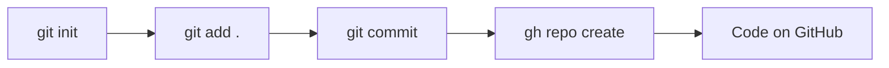

### Output
- Repository: `https://github.com/kalal-shivakumar/html-webapp`
- Branch: `master`

---

## Stage 3: Azure Resource Group Creation

**What it is:** A folder in Azure to organize all your resources in one place.
**How it helps:** Makes it easy to manage everything together and delete everything at once when done.

### What this does
Creates an Azure Resource Group to logically group all related resources (App Service Plan, Web App).

### Architecture

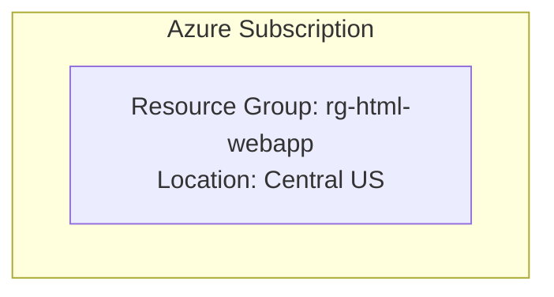

### Manual Steps
1. Log in to Azure CLI
2. Create a resource group in your preferred region

### Commands

```powershell
# Verify Azure login
az account show --output table

# Create resource group
az group create --name rg-html-webapp --location centralus --output table
```

### Parameters
| Parameter | Value | Description |
|-----------|-------|-------------|
| `--name` | `rg-html-webapp` | Resource group name |
| `--location` | `centralus` | Azure region |

---

## Stage 4: App Service Plan & Web App

**What it is:** The server (App Service Plan) and your website (Web App) that people can visit online.
**How it helps:** Together they make your website accessible to anyone on the internet.

### What this does
Creates an App Service Plan (the compute infrastructure) and a Web App (the application endpoint) to host the static HTML site.

### Architecture

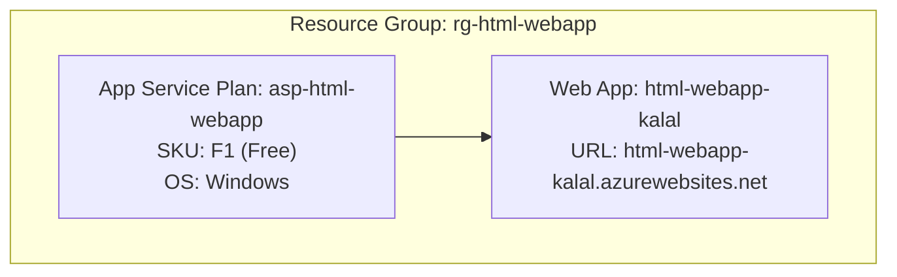

### Manual Steps
1. Create an App Service Plan (Free tier)
2. Create a Web App on that plan

### Commands

```powershell
# Create App Service Plan (Free tier, Windows, Central US)
az appservice plan create \
    --name asp-html-webapp \
    --resource-group rg-html-webapp \
    --sku F1 \
    --location centralus \
    --output table

# Create the Web App
az webapp create \
    --name html-webapp-kalal \
    --resource-group rg-html-webapp \
    --plan asp-html-webapp \
    --output table
```

### Parameters
| Parameter | Value | Description |
|-----------|-------|-------------|
| App Service Plan | `asp-html-webapp` | Compute plan name |
| SKU | `F1` | Free tier (60 min/day CPU) |
| Web App Name | `html-webapp-kalal` | Globally unique app name |
| URL | `https://html-webapp-kalal.azurewebsites.net` | Public endpoint |

> **Note:** If you encounter quota errors in `eastus`, try `centralus` or another region.

---

## Stage 5: App Registration & Federated Credentials

**What it is:** A safe way for GitHub to log into Azure automatically without passwords.
**How it helps:** GitHub can access Azure whenever it needs to, with zero risk of passwords being exposed.

### What this does
Creates an Entra ID (Azure AD) App Registration with a federated credential that allows GitHub Actions to authenticate to Azure without storing secrets — using OpenID Connect (OIDC).

### Architecture

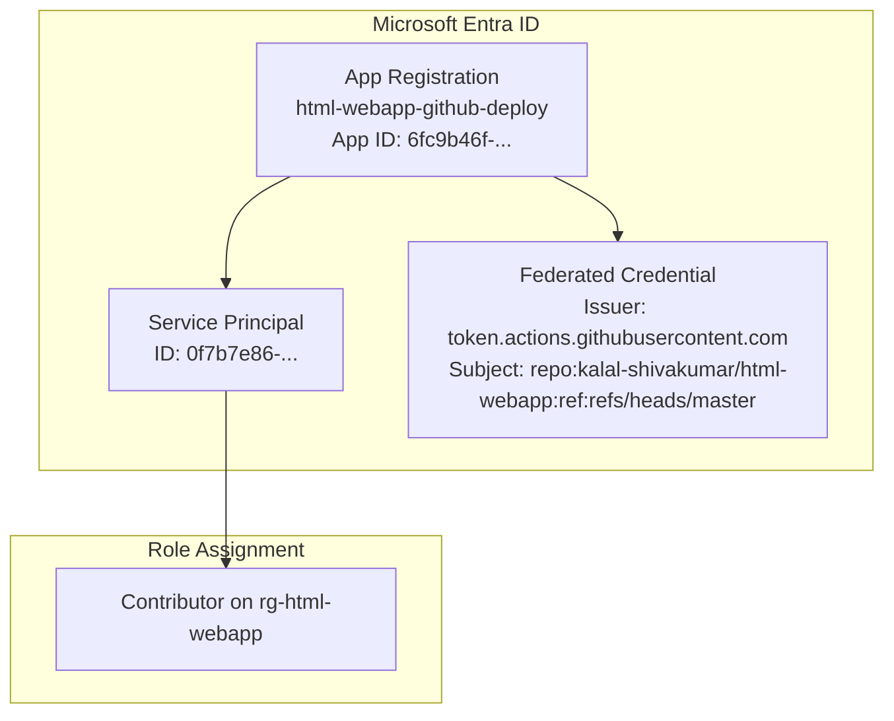

### OIDC Flow Diagram

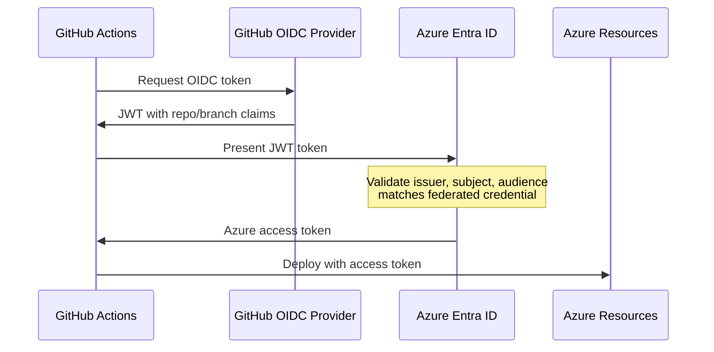

### Manual Steps
1. Create an App Registration
2. Create a Service Principal
3. Assign Contributor role on the resource group
4. Create a federated credential for GitHub Actions

### Commands

```powershell
# Step 1: Create App Registration
az ad app create --display-name "html-webapp-github-deploy" --query "{appId: appId, id: id}" --output json
# Note the appId and id (object ID) from the output

# Step 2: Create Service Principal
az ad sp create --id <APP_ID> --query "{id: id, appId: appId}" --output json

# Step 3: Assign Contributor role to the service principal on the resource group
az role assignment create \
    --assignee <APP_ID> \
    --role Contributor \
    --scope /subscriptions/<SUBSCRIPTION_ID>/resourceGroups/rg-html-webapp \
    --output table

# Step 4: Create federated credential (use a JSON file to avoid quoting issues)
```

### Federated Credential JSON (`fedcred.json`)

```json
{
    "name": "github-deploy-master",
    "issuer": "https://token.actions.githubusercontent.com",
    "subject": "repo:kalal-shivakumar/html-webapp:ref:refs/heads/master",
    "audiences": ["api://AzureADTokenExchange"]
}
```

```powershell
# Create the federated credential from file
az ad app federated-credential create \
    --id <APP_OBJECT_ID> \
    --parameters "@fedcred.json" \
    --output table
```

### Values to Note

| Secret | Value | Description |
|--------|-------|-------------|
| `AZURE_CLIENT_ID` | `6fc9b46f-3854-4053-a8a5-b66e10eccc06` | App Registration Application (client) ID |
| `AZURE_TENANT_ID` | `a87d418a-4991-4593-b472-b6ede0e96c60` | Azure AD Tenant ID |
| `AZURE_SUBSCRIPTION_ID` | `eea9ffc5-6c64-4dab-b152-3d2f49a73ff1` | Azure Subscription ID |

---

## Stage 5.1: Create App Registration & Federated Credentials Manually via Azure Portal (Step-by-Step)

This is a complete manual walkthrough to connect **https://github.com/kalal-shivakumar/kalal.git** (branch: `main`) to Azure using federated credentials. **No JSON files or CLI commands needed** — everything is done through the portal UI.

### Full Flow Overview

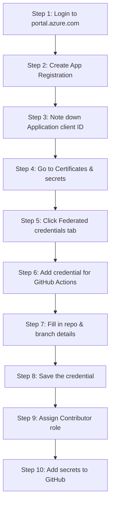

---

### Step 1: Login to Azure Portal

1. Open your browser and go to **https://portal.azure.com**
2. Sign in with your Azure account (e.g., `kalalshivakumar2085@gmail.com`)
3. You will land on the Azure Portal home page

---

### Step 2: Create a New App Registration

1. In the **top search bar**, type: **App registrations**
2. Click on **"App registrations"** under Services
3. You will see the App registrations page
4. Click the **"+ New registration"** button at the top

Fill in the form:

| Field | What to enter |
|-------|--------------|
| **Name** | `kalal-github-deploy` |
| **Supported account types** | Select **"Accounts in this organizational directory only (Default Directory only - Single tenant)"** |
| **Redirect URI (optional)** | Leave this **blank** — not needed |

5. Click **"Register"**

---

### Step 3: Note Down the Important IDs

After clicking Register, you land on the **Overview** page of your new App Registration. You will see:

| Field on screen | Example Value | What it is |
|----------------|---------------|------------|
| **Application (client) ID** | `1ba7f813-f04a-4df1-bc14-997d883f6654` | This is your `AZURE_CLIENT_ID` |
| **Directory (tenant) ID** | `a87d418a-4991-4593-b472-b6ede0e96c60` | This is your `AZURE_TENANT_ID` |
| **Object ID** | (a different GUID) | Internal ID — not needed for GitHub secrets |

> 📝 **Copy the Application (client) ID and Directory (tenant) ID** — you will need them later for GitHub secrets.

---

### Step 4: Navigate to Certificates & secrets

1. On the left sidebar menu of your App Registration (`kalal-github-deploy`), look for **"Manage"** section
2. Click **"Certificates & secrets"**
3. You will see **three tabs** at the top:

| Tab | Purpose |
|-----|---------|
| **Certificates** | Upload certificate files (.cer, .pem) — NOT needed here |
| **Client secrets** | Generate password-like secrets — ❌ NOT recommended for GitHub Actions |
| **Federated credentials** | OIDC passwordless connection — ✅ **THIS IS WHAT WE NEED** |

---

### Step 5: Click on Federated credentials Tab

1. Click the **"Federated credentials"** tab
2. You will see an empty list (no credentials yet)
3. Click the **"+ Add credential"** button

---

### Step 6: Select the Scenario

A panel opens on the right side titled **"Add a credential"**. At the top you see **"Federated credential scenario"** dropdown.

Click the dropdown and you will see these options:

| Scenario Option | When to use |
|----------------|-------------|
| **GitHub Actions deploying Azure resources** | ✅ **Select this one** |
| Kubernetes accessing Azure resources | For AKS/Kubernetes workloads |
| Other issuer | For custom OIDC providers |

Select: **"GitHub Actions deploying Azure resources"**

---

### Step 7: Fill in the GitHub Connection Details

After selecting GitHub Actions, the form expands. Fill in **exactly** these values:

| Field | What to type | Explanation |
|-------|-------------|-------------|
| **Organization** | `kalal-shivakumar` | Your GitHub username (the part before `/` in the repo URL) |
| **Repository** | `kalal` | Just the repo name (NOT the full URL, NOT `kalal-shivakumar/kalal`) |
| **Entity type** | Select **"Branch"** from the dropdown | Because we deploy from a specific branch |
| **GitHub branch name** | `main` | The branch that triggers deployment — must be exactly `main` |
| **Name** | `github-deploy-main` | A friendly name for this credential (no spaces, use hyphens) |
| **Description** (optional) | `GitHub Actions OIDC for kalal main branch` | Optional helpful note |

> ⚠️ **CRITICAL:** The **Repository** field must be just `kalal`, NOT `kalal-shivakumar/kalal` and NOT the full URL.

> ⚠️ **CRITICAL:** The **branch name** must be exactly `main` (matching your GitHub default branch). If you type `master` here but your workflow runs on `main`, authentication will **FAIL**.

#### Entity Type Options Explained

| Entity Type | Field that appears | Example value | Use when... |
|-------------|-------------------|---------------|-------------|
| **Branch** | "GitHub branch name" | `main` | Deploying from a specific branch |
| **Environment** | "GitHub environment name" | `production` | Using GitHub Environments for gated deploys |
| **Tag** | "GitHub tag name" | `v1.0.0` | Deploying on release tags |
| **Pull request** | (no extra field) | — | Running on pull requests |

For this setup, choose **Branch** and type **`main`**.

---

### Step 8: Review the Auto-Generated Values and Save

Before clicking Add, the portal shows you the auto-generated values at the bottom of the form. Verify they look like this:

| Auto-generated field | Expected value |
|---------------------|----------------|
| **Issuer** | `https://token.actions.githubusercontent.com` |
| **Subject identifier** | `repo:kalal-shivakumar/kalal:ref:refs/heads/main` |
| **Audience** | `api://AzureADTokenExchange` |

> 📝 These values are **generated automatically** by the portal based on what you typed. You do NOT need to edit them.

**If these look correct, click the "Add" button.**

---

### Step 9: Verify the Credential Was Created

After clicking Add, you are taken back to the **Federated credentials** tab. You should now see:

| Column | Value |
|--------|-------|
| **Name** | `github-deploy-main` |
| **Issuer** | `https://token.actions.githubusercontent.com` |
| **Subject identifier** | `repo:kalal-shivakumar/kalal:ref:refs/heads/main` |

✅ Your federated credential is now created. **No JSON file upload was needed** — the portal handled everything.

> 📝 **No file creation or upload is required for this step.** The Azure Portal builds the federated credential configuration entirely through the GUI form. JSON files are only needed if you use the Azure CLI (`az ad app federated-credential create --parameters "@fedcred.json"`), which we are NOT using here.

---

### Step 10: Assign Contributor Role to the App Registration (via Portal)

The App Registration needs permission to deploy resources. You must assign it the **Contributor** role on your Resource Group.

1. In the **top search bar**, type: **Resource groups**
2. Click on **"Resource groups"** under Services
3. Click on your resource group: **`rg-kalal`**
4. In the left sidebar, click **"Access control (IAM)"**
5. Click **"+ Add"** → select **"Add role assignment"**

#### 5a. Role tab
1. In the search box, type: **Contributor**
2. Click on **"Contributor"** from the list (it says "Grants full access to manage all resources, but does not allow you to assign roles...")
3. Click **"Next"**

#### 5b. Members tab
1. For **"Assign access to"**, select: **"User, group, or service principal"**
2. Click **"+ Select members"**
3. In the search box that appears on the right panel, type: **`kalal-github-deploy`**
4. You should see your App Registration appear in the results
5. **Click on it** to select it (it gets a checkmark)
6. Click **"Select"**
7. Click **"Next"**

#### 5c. Review + assign tab
1. Review the summary:
   - **Role:** Contributor
   - **Members:** `kalal-github-deploy`
   - **Scope:** `/subscriptions/eea9ffc5-6c64-4dab-b152-3d2f49a73ff1/resourceGroups/rg-kalal`
2. Click **"Review + assign"**

✅ Role assignment complete. The App Registration can now deploy to your resource group.

---

### Step 11: Add Secrets to GitHub (via Portal)

Now go to your GitHub repository and add the Azure IDs as secrets.

1. Open your browser and go to: **https://github.com/kalal-shivakumar/kalal**
2. Click **"Settings"** tab (top right, next to Insights)
3. In the left sidebar, expand **"Secrets and variables"**
4. Click **"Actions"**
5. Click **"New repository secret"**

Add these **three secrets** one by one:

#### Secret 1:
| Field | Value |
|-------|-------|
| **Name** | `AZURE_CLIENT_ID` |
| **Secret** | `1ba7f813-f04a-4df1-bc14-997d883f6654` |

Click **"Add secret"**

#### Secret 2:
| Field | Value |
|-------|-------|
| **Name** | `AZURE_TENANT_ID` |
| **Secret** | `a87d418a-4991-4593-b472-b6ede0e96c60` |

Click **"Add secret"**

#### Secret 3:
| Field | Value |
|-------|-------|
| **Name** | `AZURE_SUBSCRIPTION_ID` |
| **Secret** | `eea9ffc5-6c64-4dab-b152-3d2f49a73ff1` |

Click **"Add secret"**

After adding all three, your **Actions secrets** page should show:

```
AZURE_CLIENT_ID          Updated just now
AZURE_SUBSCRIPTION_ID    Updated just now
AZURE_TENANT_ID          Updated just now
```

---

### Summary: What You Created (No Files Needed)

| What | Where | How |
|------|-------|-----|
| App Registration (`kalal-github-deploy`) | Azure Portal → App registrations | GUI form |
| Federated Credential (`github-deploy-main`) | Azure Portal → App Registration → Certificates & secrets → Federated credentials | GUI form (no JSON upload) |
| Contributor Role Assignment | Azure Portal → Resource Group → Access control (IAM) | GUI form |
| GitHub Secrets (3 secrets) | GitHub → Settings → Secrets and variables → Actions | GUI form |

> 📝 **Important:** You did NOT need to create or upload any JSON file. Everything was done through portal forms. The JSON file method (`fedcred.json`) is only needed when using the Azure CLI command `az ad app federated-credential create`.

---

### Understanding the Subject Identifier Format

The subject identifier tells Azure which specific GitHub workflow is allowed to authenticate:

```
repo:<owner>/<repo>:ref:refs/heads/<branch>        # For branch-based
repo:<owner>/<repo>:environment:<env-name>          # For environment-based
repo:<owner>/<repo>:ref:refs/tags/<tag>             # For tag-based
repo:<owner>/<repo>:pull_request                    # For pull requests
```

For this project:
```
repo:kalal-shivakumar/kalal:ref:refs/heads/main
```

### Adding Multiple Federated Credentials

You can repeat Steps 5-8 to add more credentials for different branches/scenarios:

| Name | Entity Type | Value | Use Case |
|------|-------------|-------|----------|
| `github-deploy-main` | Branch | `main` | Production deployments |
| `github-deploy-develop` | Branch | `develop` | Staging deployments |
| `github-deploy-production` | Environment | `production` | Environment-gated deploys |
| `github-deploy-tags` | Tag | `v*` | Release deployments |

### Common Mistakes to Avoid

| Mistake | What happens | Fix |
|---------|-------------|-----|
| Typing `kalal-shivakumar/kalal` in the Repository field | Credential fails to match | Type only `kalal` |
| Typing `master` in branch name when your branch is `main` | Authentication fails with 403 | Type exactly `main` |
| Forgetting to assign Contributor role (Step 10) | Deployment fails with authorization error | Complete Step 10 |
| Creating a Client Secret instead of Federated Credential | Unnecessary secret rotation, less secure | Use Federated credentials tab, NOT Client secrets tab |
| Adding secrets to GitHub with wrong names | Workflow can't find the secrets | Use exact names: `AZURE_CLIENT_ID`, `AZURE_TENANT_ID`, `AZURE_SUBSCRIPTION_ID` |

### Security Benefits of Federated Credentials vs Client Secrets

| Feature | Client Secrets | Federated Credentials |
|---------|---------------|----------------------|
| Secret stored in GitHub | ✅ Yes (risk) | ❌ No |
| Needs rotation | ✅ Every 6-24 months | ❌ Never |
| Can be leaked in logs | ✅ Possible | ❌ Impossible |
| Scoped to specific repo/branch | ❌ No | ✅ Yes |
| Best practice for CI/CD | ❌ | ✅ |

---

## Stage 6: Adding Secrets to GitHub

**What it is:** Secret login information stored safely in GitHub for your workflow to use.
**How it helps:** Your workflow can log into Azure using these secrets without them being visible anywhere.

### What this does
Stores the Azure authentication values as encrypted secrets in the GitHub repository, which the workflow will use to authenticate.

### Architecture

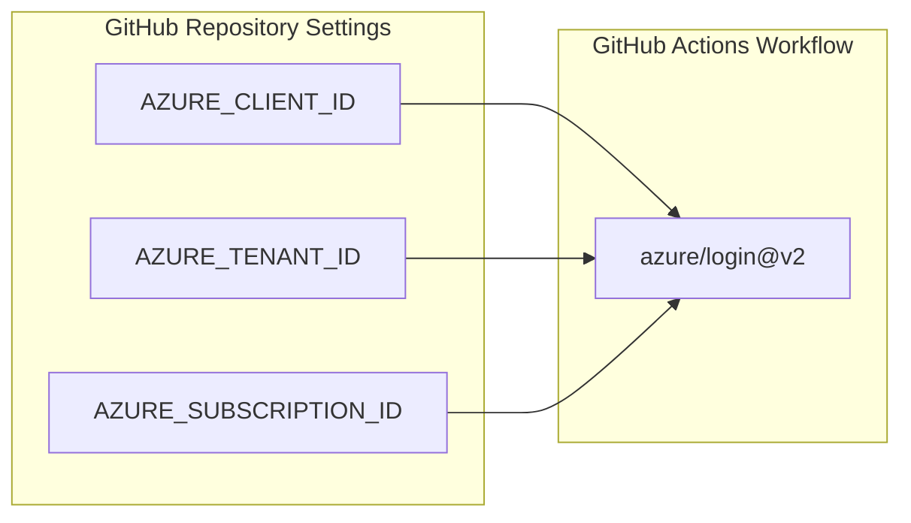

### Manual Steps
1. Set `AZURE_CLIENT_ID` secret
2. Set `AZURE_TENANT_ID` secret
3. Set `AZURE_SUBSCRIPTION_ID` secret

### Commands

```powershell
# Set AZURE_CLIENT_ID
gh secret set AZURE_CLIENT_ID --body "<APP_CLIENT_ID>" --repo <owner>/html-webapp

# Set AZURE_TENANT_ID
gh secret set AZURE_TENANT_ID --body "<TENANT_ID>" --repo <owner>/html-webapp

# Set AZURE_SUBSCRIPTION_ID
gh secret set AZURE_SUBSCRIPTION_ID --body "<SUBSCRIPTION_ID>" --repo <owner>/html-webapp

# Verify secrets are set
gh secret list --repo <owner>/html-webapp
```

### Actual Commands Used

```powershell
gh secret set AZURE_CLIENT_ID --body "6fc9b46f-3854-4053-a8a5-b66e10eccc06" --repo kalal-shivakumar/html-webapp
gh secret set AZURE_TENANT_ID --body "a87d418a-4991-4593-b472-b6ede0e96c60" --repo kalal-shivakumar/html-webapp
gh secret set AZURE_SUBSCRIPTION_ID --body "eea9ffc5-6c64-4dab-b152-3d2f49a73ff1" --repo kalal-shivakumar/html-webapp
```

---

## Stage 7: Create GitHub Actions Workflow

**What it is:** A file that tells GitHub to automatically build and upload your code to Azure.
**How it helps:** Every time you upload code, GitHub automatically handles everything without you doing it manually.

### What this does
Creates a CI/CD pipeline that automatically deploys the app to Azure whenever code is pushed to the `master` branch.

### Workflow Architecture

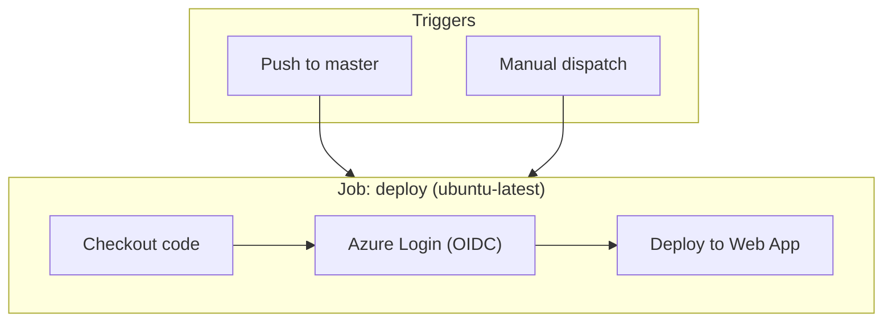

### Manual Steps
1. Create `.github/workflows/` directory
2. Create `deploy.yml` workflow file
3. Commit and push

### File: `.github/workflows/deploy.yml`

```yaml
name: Deploy to Azure

on:
  push:
    branches: [ main ]
  workflow_dispatch:

permissions:
  id-token: write
  contents: read

jobs:
  deploy:
    runs-on: ubuntu-latest
    steps:
      - uses: actions/checkout@v4
      
      - uses: azure/login@v2
        with:
          client-id: ${{ secrets.CLIENTID }}
          tenant-id: ${{ secrets.TENANTID }}
          subscription-id: ${{ secrets.SUBSCRIPTIONID }}
      
      - uses: azure/webapps-deploy@v3
        with:
          app-name: kalal-java-app
          package: .
```

### Key Configuration Explained

| Setting | Purpose |
|---------|---------|
| `permissions.id-token: write` | Required for OIDC token generation |
| `permissions.contents: read` | Required for checkout |
| `azure/login@v2` | Handles OIDC authentication to Azure |
| `azure/webapps-deploy@v3` | Deploys files to Azure App Service |
| `workflow_dispatch` | Allows manual trigger from GitHub UI |

### Commands

```powershell
# Create workflow directory and file
mkdir -p .github/workflows

# (Create deploy.yml with content above)

# Commit and push
git add .github/
git commit -m "Add GitHub Actions deploy workflow"
git push origin master
```

---

## Stage 8: Run the Workflow

**What it is:** GitHub automatically builds and uploads your website to Azure.
**How it helps:** You can watch it happen in real-time and catch any problems before your website goes live.

### What this does
The workflow runs automatically on push to `master`. You can also trigger it manually or monitor its status.

### Commands

```powershell
# List recent workflow runs
gh run list --repo kalal-shivakumar/html-webapp --limit 5

# Watch a workflow run in real-time
gh run watch --repo kalal-shivakumar/html-webapp --exit-status

# Manually trigger the workflow
gh workflow run deploy.yml --repo kalal-shivakumar/html-webapp --ref master

# View workflow run logs
gh run view <RUN_ID> --repo kalal-shivakumar/html-webapp --log
```

### Successful Run Output

```
✓ master Deploy to Azure App Service · 28079008465
Triggered via push about 1 minute ago

JOBS
✓ deploy in 27s (ID 83129408851)
  ✓ Set up job
  ✓ Checkout code
  ✓ Login to Azure
  ✓ Deploy to Azure Web App
  ✓ Post Login to Azure
  ✓ Post Checkout code
  ✓ Complete job
```

---

## End-to-End Architecture

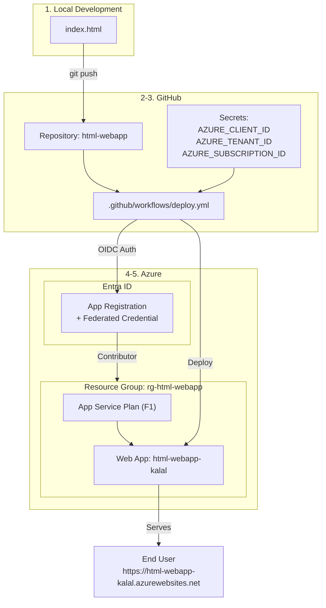

---

## Quick Reference - All Commands

```powershell
# === STAGE 1: Create Project ===
mkdir HTML-WebApp && cd HTML-WebApp
# Create index.html

# === STAGE 2: Git & GitHub ===
git init
git add .
git commit -m "Initial commit: add index.html"
gh repo create html-webapp --public --source=. --remote=origin --push

# === STAGE 3: Resource Group ===
az group create --name rg-html-webapp --location centralus

# === STAGE 4: App Service ===
az appservice plan create --name asp-html-webapp --resource-group rg-html-webapp --sku F1 --location centralus
az webapp create --name html-webapp-kalal --resource-group rg-html-webapp --plan asp-html-webapp

# === STAGE 5: App Registration + Federated Credential ===
az ad app create --display-name "html-webapp-github-deploy"
az ad sp create --id <APP_ID>
az role assignment create --assignee <APP_ID> --role Contributor --scope /subscriptions/<SUB_ID>/resourceGroups/rg-html-webapp
az ad app federated-credential create --id <APP_OBJECT_ID> --parameters "@fedcred.json"

# === STAGE 6: GitHub Secrets ===
gh secret set AZURE_CLIENT_ID --body "<value>" --repo <owner>/html-webapp
gh secret set AZURE_TENANT_ID --body "<value>" --repo <owner>/html-webapp
gh secret set AZURE_SUBSCRIPTION_ID --body "<value>" --repo <owner>/html-webapp

# === STAGE 7: Workflow ===
# Create .github/workflows/deploy.yml
git add .github/
git commit -m "Add GitHub Actions deploy workflow"
git push origin master

# === STAGE 8: Run & Monitor ===
gh run list --repo <owner>/html-webapp
gh run watch --repo <owner>/html-webapp --exit-status
```

---

## Automated Way

This section provides **individual CLI commands** for every resource created in this project. Each command is self-contained — run them one by one in PowerShell.

> **Prerequisites:** Azure CLI (`az`) and GitHub CLI (`gh`) must be installed and authenticated.

---

### 1. Azure Login

```powershell
# Login to Azure (opens browser for authentication)
az login
```

```powershell
# Verify you are logged in and check your subscription
az account show --output table
```

**Expected output:**

| Name | SubscriptionId | TenantId | State |
|------|---------------|----------|-------|
| Azure subscription 1 | eea9ffc5-6c64-4dab-b152-3d2f49a73ff1 | a87d418a-4991-4593-b472-b6ede0e96c60 | Enabled |

---

### 2. Create Resource Group

```powershell
az group create --name rg-kalal --location centralus --output table
```

**What it creates:** A logical container in Azure to hold the App Service Plan and Web App.

| Parameter | Value |
|-----------|-------|
| Name | `rg-kalal` |
| Location | `centralus` |

---

### 3. Create App Service Plan

```powershell
az appservice plan create --name plan-kalal --resource-group rg-kalal --sku F1 --is-linux --location centralus --output table
```

**What it creates:** The compute infrastructure (server) that hosts the web app.

| Parameter | Value |
|-----------|-------|
| Name | `plan-kalal` |
| SKU | `F1` (Free tier) |
| OS | Linux |
| Location | `centralus` |

---

### 4. Create Web App

```powershell
az webapp create --name kalal-java-app --resource-group rg-kalal --plan plan-kalal --runtime "JAVA:17-java17" --output table
```

**What it creates:** The web application endpoint that serves your Java website.

| Parameter | Value |
|-----------|-------|
| Name | `kalal-java-app` |
| Runtime | Java 17 |
| URL | `https://kalal-java-app.azurewebsites.net` |

---

### 5. Create App Registration

```powershell
az ad app create --display-name "kalal-github-deploy" --output json --query "{appId: appId, id: id}"
```

**What it creates:** An identity in Microsoft Entra ID that GitHub Actions will use to authenticate.

**Save these values from the output:**

| Output Field | What it is | Used as |
|-------------|------------|---------|
| `appId` | Application (client) ID | `CLIENTID` GitHub secret |
| `id` | Object ID | Needed for federated credential creation |

---

### 6. Create Service Principal

```powershell
az ad sp create --id <APP_ID> --output json --query "{id: id, appId: appId}"
```

> Replace `<APP_ID>` with the `appId` from Step 5.

**Example:**

```powershell
az ad sp create --id 1ba7f813-f04a-4df1-bc14-997d883f6654 --output json --query "{id: id, appId: appId}"
```

**What it creates:** A service principal (the "executable identity") linked to the App Registration.

---

### 7. Assign Contributor Role

```powershell
az role assignment create --assignee <APP_ID> --role Contributor --scope /subscriptions/<SUBSCRIPTION_ID>/resourceGroups/rg-kalal --output table
```

> Replace `<APP_ID>` and `<SUBSCRIPTION_ID>` with your values.

**Example:**

```powershell
az role assignment create --assignee 1ba7f813-f04a-4df1-bc14-997d883f6654 --role Contributor --scope /subscriptions/eea9ffc5-6c64-4dab-b152-3d2f49a73ff1/resourceGroups/rg-kalal --output table
```

**What it does:** Grants the service principal permission to deploy resources inside the `rg-kalal` resource group.

---

### 8. Create Federated Credential

First, create the JSON configuration file:

```powershell
@'
{
    "name": "github-deploy-main",
    "issuer": "https://token.actions.githubusercontent.com",
    "subject": "repo:kalal-shivakumar/kalal:ref:refs/heads/main",
    "audiences": ["api://AzureADTokenExchange"]
}
'@ | Out-File -FilePath fedcred.json -Encoding UTF8
```

Then create the federated credential:

```powershell
az ad app federated-credential create --id <APP_OBJECT_ID> --parameters "@fedcred.json" --output table
```

> Replace `<APP_OBJECT_ID>` with the `id` (Object ID) from Step 5 — NOT the `appId`.

**Example:**

```powershell
az ad app federated-credential create --id 00000000-0000-0000-0000-000000000000 --parameters "@fedcred.json" --output table
```

**What it creates:** An OIDC trust between this App Registration and the GitHub repo `kalal-shivakumar/kalal` (branch `main`).

| Parameter in JSON | Value | Purpose |
|-------------------|-------|---------|
| `name` | `github-deploy-main` | Friendly name |
| `issuer` | `https://token.actions.githubusercontent.com` | GitHub's OIDC provider URL |
| `subject` | `repo:kalal-shivakumar/kalal:ref:refs/heads/main` | Limits access to this specific repo and branch |
| `audiences` | `api://AzureADTokenExchange` | Azure's expected audience value |

Clean up the temporary file:

```powershell
Remove-Item fedcred.json
```

---

### 9. Initialize Git Repository

```powershell
git init
```

```powershell
git add .
```

```powershell
git commit -m "Initial commit: Java Spring Boot website"
```

---

### 10. Create GitHub Repository and Push

```powershell
git remote add origin https://github.com/kalal-shivakumar/kalal.git
```

```powershell
git branch -M main
```

```powershell
git push -u origin main
```

---

### 11. Set GitHub Secret — CLIENTID

```powershell
gh secret set CLIENTID --body "<APP_CLIENT_ID>" --repo kalal-shivakumar/kalal
```

**Example:**

```powershell
gh secret set CLIENTID --body "1ba7f813-f04a-4df1-bc14-997d883f6654" --repo kalal-shivakumar/kalal
```

---

### 12. Set GitHub Secret — TENANTID

```powershell
gh secret set TENANTID --body "<TENANT_ID>" --repo kalal-shivakumar/kalal
```

**Example:**

```powershell
gh secret set TENANTID --body "a87d418a-4991-4593-b472-b6ede0e96c60" --repo kalal-shivakumar/kalal
```

---

### 13. Set GitHub Secret — SUBSCRIPTIONID

```powershell
gh secret set SUBSCRIPTIONID --body "<SUBSCRIPTION_ID>" --repo kalal-shivakumar/kalal
```

**Example:**

```powershell
gh secret set SUBSCRIPTIONID --body "eea9ffc5-6c64-4dab-b152-3d2f49a73ff1" --repo kalal-shivakumar/kalal
```

---

### 14. Verify GitHub Secrets

```powershell
gh secret list --repo kalal-shivakumar/kalal
```

**Expected output:**

```
CLIENTID          Updated 2026-06-24
SUBSCRIPTIONID    Updated 2026-06-24
TENANTID          Updated 2026-06-24
```

---

### 15. Trigger the Workflow Manually

```powershell
gh workflow run deploy.yml --repo kalal-shivakumar/kalal --ref main
```

---

### 16. Monitor the Workflow Run

```powershell
gh run list --repo kalal-shivakumar/kalal --limit 5
```

```powershell
gh run watch --repo kalal-shivakumar/kalal --exit-status
```

---

### 17. Verify the Deployment

```powershell
az webapp show --name kalal-java-app --resource-group rg-kalal --query "{state: state, url: defaultHostName}" --output table
```

**Expected output:**

| State | Url |
|-------|-----|
| Running | `kalal-java-app.azurewebsites.net` |

Open in browser: **https://kalal-java-app.azurewebsites.net**

---

### Automated Way — Quick Reference (All Commands)

```powershell
# 1. Login
az login

# 2. Resource Group
az group create --name rg-kalal --location centralus --output table

# 3. App Service Plan
az appservice plan create --name plan-kalal --resource-group rg-kalal --sku F1 --is-linux --location centralus --output table

# 4. Web App
az webapp create --name kalal-java-app --resource-group rg-kalal --plan plan-kalal --runtime "JAVA:17-java17" --output table

# 5. App Registration
az ad app create --display-name "kalal-github-deploy" --output json --query "{appId: appId, id: id}"

# 6. Service Principal (replace <APP_ID>)
az ad sp create --id <APP_ID> --output json

# 7. Role Assignment (replace <APP_ID> and <SUBSCRIPTION_ID>)
az role assignment create --assignee <APP_ID> --role Contributor --scope /subscriptions/<SUBSCRIPTION_ID>/resourceGroups/rg-kalal --output table

# 8. Federated Credential (replace <APP_OBJECT_ID>)
@'
{
    "name": "github-deploy-main",
    "issuer": "https://token.actions.githubusercontent.com",
    "subject": "repo:kalal-shivakumar/kalal:ref:refs/heads/main",
    "audiences": ["api://AzureADTokenExchange"]
}
'@ | Out-File -FilePath fedcred.json -Encoding UTF8
az ad app federated-credential create --id <APP_OBJECT_ID> --parameters "@fedcred.json" --output table
Remove-Item fedcred.json

# 9. Git Init & Commit
git init
git add .
git commit -m "Initial commit: Java Spring Boot website"

# 10. Push to GitHub
git remote add origin https://github.com/kalal-shivakumar/kalal.git
git branch -M main
git push -u origin main

# 11-13. GitHub Secrets (replace values)
gh secret set CLIENTID --body "<APP_CLIENT_ID>" --repo kalal-shivakumar/kalal
gh secret set TENANTID --body "<TENANT_ID>" --repo kalal-shivakumar/kalal
gh secret set SUBSCRIPTIONID --body "<SUBSCRIPTION_ID>" --repo kalal-shivakumar/kalal

# 14. Verify Secrets
gh secret list --repo kalal-shivakumar/kalal

# 15. Trigger Workflow
gh workflow run deploy.yml --repo kalal-shivakumar/kalal --ref main

# 16. Monitor
gh run watch --repo kalal-shivakumar/kalal --exit-status

# 17. Verify
az webapp show --name kalal-java-app --resource-group rg-kalal --query "{state: state, url: defaultHostName}" --output table
```

---

### Cleanup — Delete All Resources

Delete each resource individually:

```powershell
# Delete the Web App
az webapp delete --name kalal-java-app --resource-group rg-kalal
```

```powershell
# Delete the App Service Plan
az appservice plan delete --name plan-kalal --resource-group rg-kalal --yes
```

```powershell
# Delete the Resource Group (deletes everything inside it)
az group delete --name rg-kalal --yes --no-wait
```

```powershell
# Delete the App Registration
az ad app delete --id <APP_ID>
```

```powershell
# Delete GitHub Secrets
gh secret delete CLIENTID --repo kalal-shivakumar/kalal
gh secret delete TENANTID --repo kalal-shivakumar/kalal
gh secret delete SUBSCRIPTIONID --repo kalal-shivakumar/kalal
```

---

## Cleanup

To remove all resources when no longer needed:

```powershell
# Delete Azure resources
az group delete --name rg-html-webapp --yes --no-wait

# Delete App Registration
az ad app delete --id 6fc9b46f-3854-4053-a8a5-b66e10eccc06

# Delete GitHub repo (optional)
gh repo delete kalal-shivakumar/html-webapp --yes
```

---

## Troubleshooting

| Issue | Solution |
|-------|----------|
| Quota error on App Service Plan | Try a different region (`centralus`, `westus2`, `northeurope`) |
| Federated credential JSON error in PowerShell | Write JSON to a file and use `@filename.json` syntax |
| Workflow fails on Login | Verify secrets match app registration values |
| Workflow fails on Deploy | Ensure service principal has Contributor role on the resource group |
| 403 on OIDC token | Check federated credential subject matches `repo:<owner>/<repo>:ref:refs/heads/<branch>` |
