# HTML Web App - Azure App Service Deployment with GitHub Actions

A simple HTML web application deployed to Azure App Service using GitHub Actions with OIDC (OpenID Connect) federated credentials for passwordless authentication.

---

## Architecture Overview

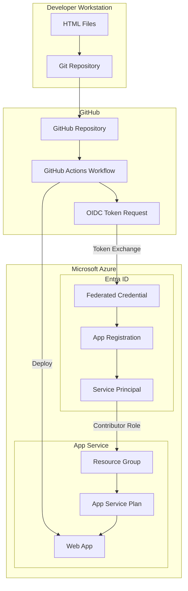

---

## Deployment Flow

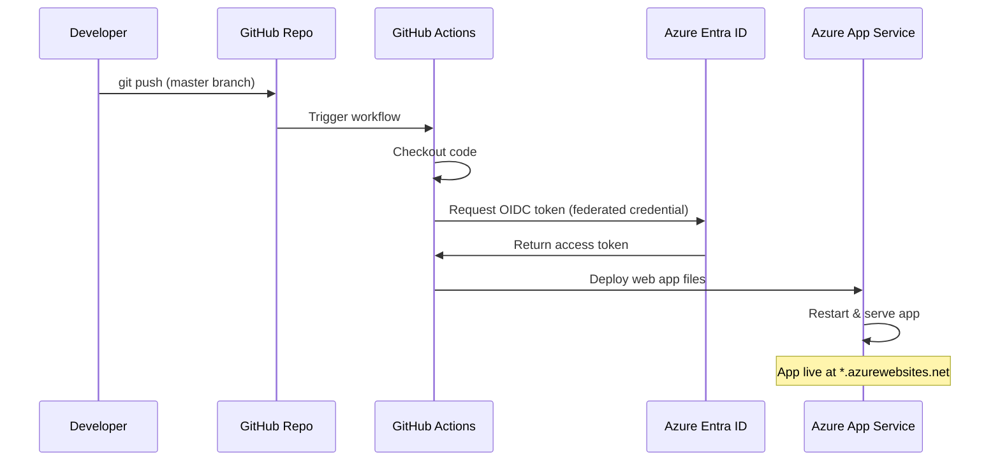

---

## Prerequisites

- [Git](https://git-scm.com/downloads) installed
- [Azure CLI](https://learn.microsoft.com/en-us/cli/azure/install-azure-cli) installed and logged in
- [GitHub CLI (gh)](https://cli.github.com/) installed and authenticated
- An active Azure subscription
- A GitHub account

---

## Stage 1: Create Project Folder and HTML Files

### What this does
Creates the project directory and a basic HTML file that will be served by Azure App Service.

### Manual Steps
1. Create a new folder for the project
2. Create an `index.html` file with basic HTML content

### Commands

```powershell
# Create project directory
mkdir C:\Users\P9202728\HTML-WebApp
cd C:\Users\P9202728\HTML-WebApp
```

### File: `index.html`

```html
<!DOCTYPE html>
<html lang="en">
<head>
    <meta charset="UTF-8">
    <meta name="viewport" content="width=device-width, initial-scale=1.0">
    <title>HTML Web App</title>
    <style>
        body {
            font-family: Arial, sans-serif;
            display: flex;
            justify-content: center;
            align-items: center;
            min-height: 100vh;
            margin: 0;
            background-color: #f0f0f0;
        }
        .container {
            text-align: center;
            padding: 2rem;
            background: white;
            border-radius: 8px;
            box-shadow: 0 2px 10px rgba(0,0,0,0.1);
        }
        h1 { color: #333; }
        p { color: #666; }
    </style>
</head>
<body>
    <div class="container">
        <h1>Hello, Azure!</h1>
        <p>This is a simple HTML web application deployed to Azure App Service.</p>
    </div>
</body>
</html>
```

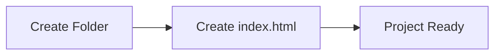

---

## Stage 2: GitHub Repository Creation & Git Commands

### What this does
Initializes a local Git repository, commits the code, creates a remote GitHub repository, and pushes the code.

### Manual Steps
1. Initialize Git in the project folder
2. Stage all files
3. Create initial commit
4. Create a GitHub repository using `gh` CLI
5. Push code to GitHub

### Commands

```powershell
# Initialize git repository
git init

# Stage all files
git add .

# Create initial commit
git commit -m "Initial commit: add index.html"

# Create GitHub repo and push (using gh CLI)
# This creates the repo, sets the remote, and pushes in one command
gh repo create html-webapp --public --source=. --remote=origin --push
```

### Alternative (Manual Remote Setup)

```powershell
# If you already have a GitHub repo created via the web UI:
git remote add origin https://github.com/<username>/html-webapp.git
git branch -M master
git push -u origin master
```

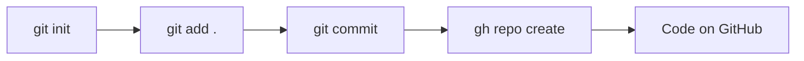

### Output
- Repository: `https://github.com/kalal-shivakumar/html-webapp`
- Branch: `master`

---

## Stage 3: Azure Resource Group Creation

### What this does
Creates an Azure Resource Group to logically group all related resources (App Service Plan, Web App).

### Architecture

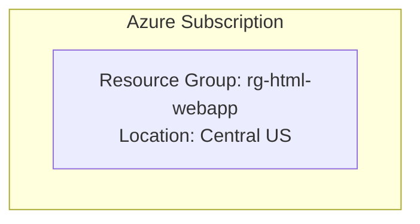

### Manual Steps
1. Log in to Azure CLI
2. Create a resource group in your preferred region

### Commands

```powershell
# Verify Azure login
az account show --output table

# Create resource group
az group create --name rg-html-webapp --location centralus --output table
```

### Parameters
| Parameter | Value | Description |
|-----------|-------|-------------|
| `--name` | `rg-html-webapp` | Resource group name |
| `--location` | `centralus` | Azure region |

---

## Stage 4: App Service Plan & Web App

### What this does
Creates an App Service Plan (the compute infrastructure) and a Web App (the application endpoint) to host the static HTML site.

### Architecture

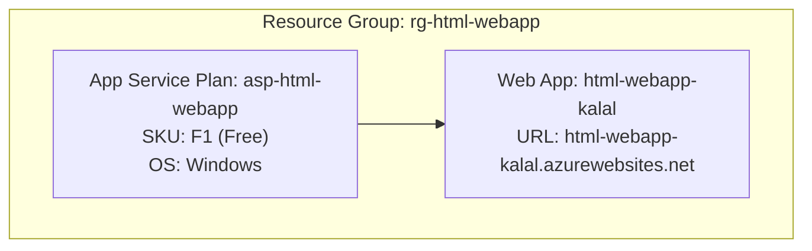

### Manual Steps
1. Create an App Service Plan (Free tier)
2. Create a Web App on that plan

### Commands

```powershell
# Create App Service Plan (Free tier, Windows, Central US)
az appservice plan create \
    --name asp-html-webapp \
    --resource-group rg-html-webapp \
    --sku F1 \
    --location centralus \
    --output table

# Create the Web App
az webapp create \
    --name html-webapp-kalal \
    --resource-group rg-html-webapp \
    --plan asp-html-webapp \
    --output table
```

### Parameters
| Parameter | Value | Description |
|-----------|-------|-------------|
| App Service Plan | `asp-html-webapp` | Compute plan name |
| SKU | `F1` | Free tier (60 min/day CPU) |
| Web App Name | `html-webapp-kalal` | Globally unique app name |
| URL | `https://html-webapp-kalal.azurewebsites.net` | Public endpoint |

> **Note:** If you encounter quota errors in `eastus`, try `centralus` or another region.

---

## Stage 5: App Registration & Federated Credentials

### What this does
Creates an Entra ID (Azure AD) App Registration with a federated credential that allows GitHub Actions to authenticate to Azure without storing secrets — using OpenID Connect (OIDC).

### Architecture

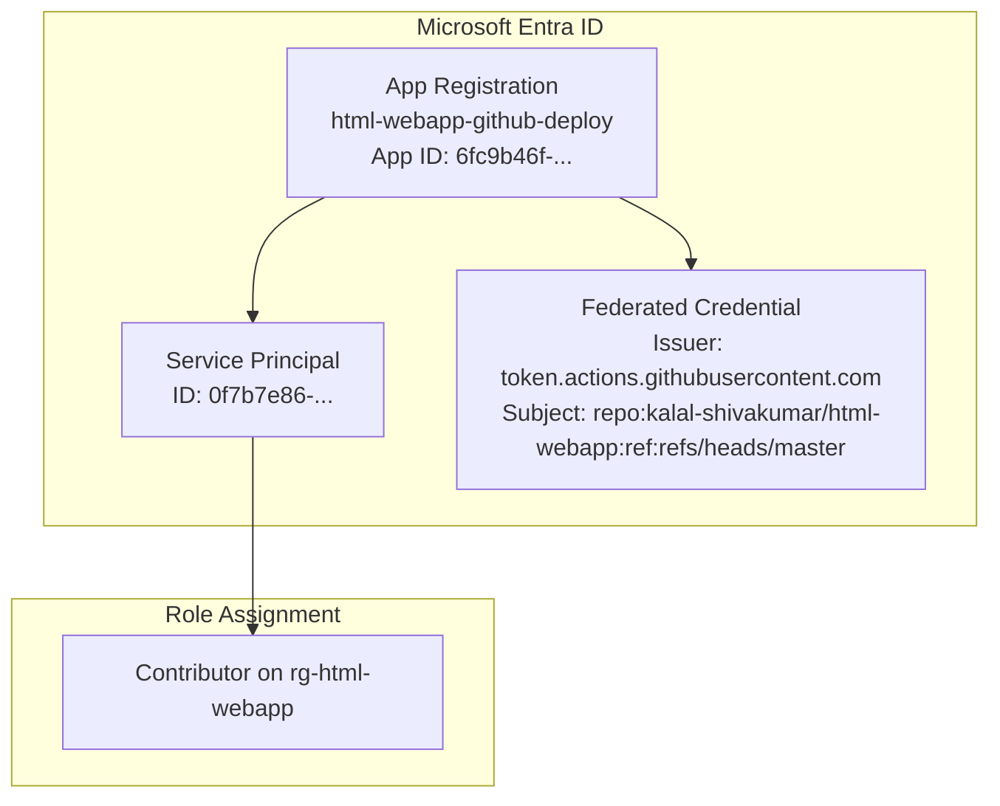

### OIDC Flow Diagram

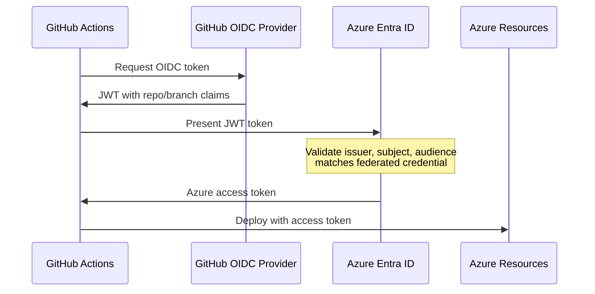

### Manual Steps
1. Create an App Registration
2. Create a Service Principal
3. Assign Contributor role on the resource group
4. Create a federated credential for GitHub Actions

### Commands

```powershell
# Step 1: Create App Registration
az ad app create --display-name "html-webapp-github-deploy" --query "{appId: appId, id: id}" --output json
# Note the appId and id (object ID) from the output

# Step 2: Create Service Principal
az ad sp create --id <APP_ID> --query "{id: id, appId: appId}" --output json

# Step 3: Assign Contributor role to the service principal on the resource group
az role assignment create \
    --assignee <APP_ID> \
    --role Contributor \
    --scope /subscriptions/<SUBSCRIPTION_ID>/resourceGroups/rg-html-webapp \
    --output table

# Step 4: Create federated credential (use a JSON file to avoid quoting issues)
```

### Federated Credential JSON (`fedcred.json`)

```json
{
    "name": "github-deploy-master",
    "issuer": "https://token.actions.githubusercontent.com",
    "subject": "repo:kalal-shivakumar/html-webapp:ref:refs/heads/master",
    "audiences": ["api://AzureADTokenExchange"]
}
```

```powershell
# Create the federated credential from file
az ad app federated-credential create \
    --id <APP_OBJECT_ID> \
    --parameters @fedcred.json \
    --output table
```

### Values to Note

| Secret | Value | Description |
|--------|-------|-------------|
| `AZURE_CLIENT_ID` | `6fc9b46f-3854-4053-a8a5-b66e10eccc06` | App Registration Application (client) ID |
| `AZURE_TENANT_ID` | `a87d418a-4991-4593-b472-b6ede0e96c60` | Azure AD Tenant ID |
| `AZURE_SUBSCRIPTION_ID` | `eea9ffc5-6c64-4dab-b152-3d2f49a73ff1` | Azure Subscription ID |

---

## Stage 5.1: Create App Registration & Federated Credentials Manually via Azure Portal (Step-by-Step)

This is a complete manual walkthrough to connect **https://github.com/kalal-shivakumar/ram09.git** (branch: `main`) to Azure using federated credentials. **No JSON files or CLI commands needed** — everything is done through the portal UI.

### Full Flow Overview

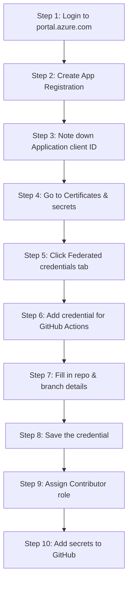

---

### Step 1: Login to Azure Portal

1. Open your browser and go to **https://portal.azure.com**
2. Sign in with your Azure account (e.g., `kalalshivakumar2085@gmail.com`)
3. You will land on the Azure Portal home page

---

### Step 2: Create a New App Registration

1. In the **top search bar**, type: **App registrations**
2. Click on **"App registrations"** under Services
3. You will see the App registrations page
4. Click the **"+ New registration"** button at the top

Fill in the form:

| Field | What to enter |
|-------|--------------|
| **Name** | `ram09-github-deploy` |
| **Supported account types** | Select **"Accounts in this organizational directory only (Default Directory only - Single tenant)"** |
| **Redirect URI (optional)** | Leave this **blank** — not needed |

5. Click **"Register"**

---

### Step 3: Note Down the Important IDs

After clicking Register, you land on the **Overview** page of your new App Registration. You will see:

| Field on screen | Example Value | What it is |
|----------------|---------------|------------|
| **Application (client) ID** | `1ba7f813-f04a-4df1-bc14-997d883f6654` | This is your `AZURE_CLIENT_ID` |
| **Directory (tenant) ID** | `a87d418a-4991-4593-b472-b6ede0e96c60` | This is your `AZURE_TENANT_ID` |
| **Object ID** | (a different GUID) | Internal ID — not needed for GitHub secrets |

> 📝 **Copy the Application (client) ID and Directory (tenant) ID** — you will need them later for GitHub secrets.

---

### Step 4: Navigate to Certificates & secrets

1. On the left sidebar menu of your App Registration (`ram09-github-deploy`), look for **"Manage"** section
2. Click **"Certificates & secrets"**
3. You will see **three tabs** at the top:

| Tab | Purpose |
|-----|---------|
| **Certificates** | Upload certificate files (.cer, .pem) — NOT needed here |
| **Client secrets** | Generate password-like secrets — ❌ NOT recommended for GitHub Actions |
| **Federated credentials** | OIDC passwordless connection — ✅ **THIS IS WHAT WE NEED** |

---

### Step 5: Click on Federated credentials Tab

1. Click the **"Federated credentials"** tab
2. You will see an empty list (no credentials yet)
3. Click the **"+ Add credential"** button

---

### Step 6: Select the Scenario

A panel opens on the right side titled **"Add a credential"**. At the top you see **"Federated credential scenario"** dropdown.

Click the dropdown and you will see these options:

| Scenario Option | When to use |
|----------------|-------------|
| **GitHub Actions deploying Azure resources** | ✅ **Select this one** |
| Kubernetes accessing Azure resources | For AKS/Kubernetes workloads |
| Other issuer | For custom OIDC providers |

Select: **"GitHub Actions deploying Azure resources"**

---

### Step 7: Fill in the GitHub Connection Details

After selecting GitHub Actions, the form expands. Fill in **exactly** these values:

| Field | What to type | Explanation |
|-------|-------------|-------------|
| **Organization** | `kalal-shivakumar` | Your GitHub username (the part before `/` in the repo URL) |
| **Repository** | `ram09` | Just the repo name (NOT the full URL, NOT `kalal-shivakumar/ram09`) |
| **Entity type** | Select **"Branch"** from the dropdown | Because we deploy from a specific branch |
| **GitHub branch name** | `main` | The branch that triggers deployment — must be exactly `main` |
| **Name** | `github-deploy-main` | A friendly name for this credential (no spaces, use hyphens) |
| **Description** (optional) | `GitHub Actions OIDC for ram09 main branch` | Optional helpful note |

> ⚠️ **CRITICAL:** The **Repository** field must be just `ram09`, NOT `kalal-shivakumar/ram09` and NOT the full URL.

> ⚠️ **CRITICAL:** The **branch name** must be exactly `main` (matching your GitHub default branch). If you type `master` here but your workflow runs on `main`, authentication will **FAIL**.

#### Entity Type Options Explained

| Entity Type | Field that appears | Example value | Use when... |
|-------------|-------------------|---------------|-------------|
| **Branch** | "GitHub branch name" | `main` | Deploying from a specific branch |
| **Environment** | "GitHub environment name" | `production` | Using GitHub Environments for gated deploys |
| **Tag** | "GitHub tag name" | `v1.0.0` | Deploying on release tags |
| **Pull request** | (no extra field) | — | Running on pull requests |

For this setup, choose **Branch** and type **`main`**.

---

### Step 8: Review the Auto-Generated Values and Save

Before clicking Add, the portal shows you the auto-generated values at the bottom of the form. Verify they look like this:

| Auto-generated field | Expected value |
|---------------------|----------------|
| **Issuer** | `https://token.actions.githubusercontent.com` |
| **Subject identifier** | `repo:kalal-shivakumar/ram09:ref:refs/heads/main` |
| **Audience** | `api://AzureADTokenExchange` |

> 📝 These values are **generated automatically** by the portal based on what you typed. You do NOT need to edit them.

**If these look correct, click the "Add" button.**

---

### Step 9: Verify the Credential Was Created

After clicking Add, you are taken back to the **Federated credentials** tab. You should now see:

| Column | Value |
|--------|-------|
| **Name** | `github-deploy-main` |
| **Issuer** | `https://token.actions.githubusercontent.com` |
| **Subject identifier** | `repo:kalal-shivakumar/ram09:ref:refs/heads/main` |

✅ Your federated credential is now created. **No JSON file upload was needed** — the portal handled everything.

> 📝 **No file creation or upload is required for this step.** The Azure Portal builds the federated credential configuration entirely through the GUI form. JSON files are only needed if you use the Azure CLI (`az ad app federated-credential create --parameters @fedcred.json`), which we are NOT using here.

---

### Step 10: Assign Contributor Role to the App Registration (via Portal)

The App Registration needs permission to deploy resources. You must assign it the **Contributor** role on your Resource Group.

1. In the **top search bar**, type: **Resource groups**
2. Click on **"Resource groups"** under Services
3. Click on your resource group: **`rg-ram09`**
4. In the left sidebar, click **"Access control (IAM)"**
5. Click **"+ Add"** → select **"Add role assignment"**

#### 5a. Role tab
1. In the search box, type: **Contributor**
2. Click on **"Contributor"** from the list (it says "Grants full access to manage all resources, but does not allow you to assign roles...")
3. Click **"Next"**

#### 5b. Members tab
1. For **"Assign access to"**, select: **"User, group, or service principal"**
2. Click **"+ Select members"**
3. In the search box that appears on the right panel, type: **`ram09-github-deploy`**
4. You should see your App Registration appear in the results
5. **Click on it** to select it (it gets a checkmark)
6. Click **"Select"**
7. Click **"Next"**

#### 5c. Review + assign tab
1. Review the summary:
   - **Role:** Contributor
   - **Members:** `ram09-github-deploy`
   - **Scope:** `/subscriptions/eea9ffc5-6c64-4dab-b152-3d2f49a73ff1/resourceGroups/rg-ram09`
2. Click **"Review + assign"**

✅ Role assignment complete. The App Registration can now deploy to your resource group.

---

### Step 11: Add Secrets to GitHub (via Portal)

Now go to your GitHub repository and add the Azure IDs as secrets.

1. Open your browser and go to: **https://github.com/kalal-shivakumar/ram09**
2. Click **"Settings"** tab (top right, next to Insights)
3. In the left sidebar, expand **"Secrets and variables"**
4. Click **"Actions"**
5. Click **"New repository secret"**

Add these **three secrets** one by one:

#### Secret 1:
| Field | Value |
|-------|-------|
| **Name** | `AZURE_CLIENT_ID` |
| **Secret** | `1ba7f813-f04a-4df1-bc14-997d883f6654` |

Click **"Add secret"**

#### Secret 2:
| Field | Value |
|-------|-------|
| **Name** | `AZURE_TENANT_ID` |
| **Secret** | `a87d418a-4991-4593-b472-b6ede0e96c60` |

Click **"Add secret"**

#### Secret 3:
| Field | Value |
|-------|-------|
| **Name** | `AZURE_SUBSCRIPTION_ID` |
| **Secret** | `eea9ffc5-6c64-4dab-b152-3d2f49a73ff1` |

Click **"Add secret"**

After adding all three, your **Actions secrets** page should show:

```
AZURE_CLIENT_ID          Updated just now
AZURE_SUBSCRIPTION_ID    Updated just now
AZURE_TENANT_ID          Updated just now
```

---

### Summary: What You Created (No Files Needed)

| What | Where | How |
|------|-------|-----|
| App Registration (`ram09-github-deploy`) | Azure Portal → App registrations | GUI form |
| Federated Credential (`github-deploy-main`) | Azure Portal → App Registration → Certificates & secrets → Federated credentials | GUI form (no JSON upload) |
| Contributor Role Assignment | Azure Portal → Resource Group → Access control (IAM) | GUI form |
| GitHub Secrets (3 secrets) | GitHub → Settings → Secrets and variables → Actions | GUI form |

> 📝 **Important:** You did NOT need to create or upload any JSON file. Everything was done through portal forms. The JSON file method (`fedcred.json`) is only needed when using the Azure CLI command `az ad app federated-credential create`.

---

### Understanding the Subject Identifier Format

The subject identifier tells Azure which specific GitHub workflow is allowed to authenticate:

```
repo:<owner>/<repo>:ref:refs/heads/<branch>        # For branch-based
repo:<owner>/<repo>:environment:<env-name>          # For environment-based
repo:<owner>/<repo>:ref:refs/tags/<tag>             # For tag-based
repo:<owner>/<repo>:pull_request                    # For pull requests
```

For this project:
```
repo:kalal-shivakumar/ram09:ref:refs/heads/main
```

### Adding Multiple Federated Credentials

You can repeat Steps 5-8 to add more credentials for different branches/scenarios:

| Name | Entity Type | Value | Use Case |
|------|-------------|-------|----------|
| `github-deploy-main` | Branch | `main` | Production deployments |
| `github-deploy-develop` | Branch | `develop` | Staging deployments |
| `github-deploy-production` | Environment | `production` | Environment-gated deploys |
| `github-deploy-tags` | Tag | `v*` | Release deployments |

### Common Mistakes to Avoid

| Mistake | What happens | Fix |
|---------|-------------|-----|
| Typing `kalal-shivakumar/ram09` in the Repository field | Credential fails to match | Type only `ram09` |
| Typing `master` in branch name when your branch is `main` | Authentication fails with 403 | Type exactly `main` |
| Forgetting to assign Contributor role (Step 10) | Deployment fails with authorization error | Complete Step 10 |
| Creating a Client Secret instead of Federated Credential | Unnecessary secret rotation, less secure | Use Federated credentials tab, NOT Client secrets tab |
| Adding secrets to GitHub with wrong names | Workflow can't find the secrets | Use exact names: `AZURE_CLIENT_ID`, `AZURE_TENANT_ID`, `AZURE_SUBSCRIPTION_ID` |

### Security Benefits of Federated Credentials vs Client Secrets

| Feature | Client Secrets | Federated Credentials |
|---------|---------------|----------------------|
| Secret stored in GitHub | ✅ Yes (risk) | ❌ No |
| Needs rotation | ✅ Every 6-24 months | ❌ Never |
| Can be leaked in logs | ✅ Possible | ❌ Impossible |
| Scoped to specific repo/branch | ❌ No | ✅ Yes |
| Best practice for CI/CD | ❌ | ✅ |

---

## Stage 6: Adding Secrets to GitHub

### What this does
Stores the Azure authentication values as encrypted secrets in the GitHub repository, which the workflow will use to authenticate.

### Architecture

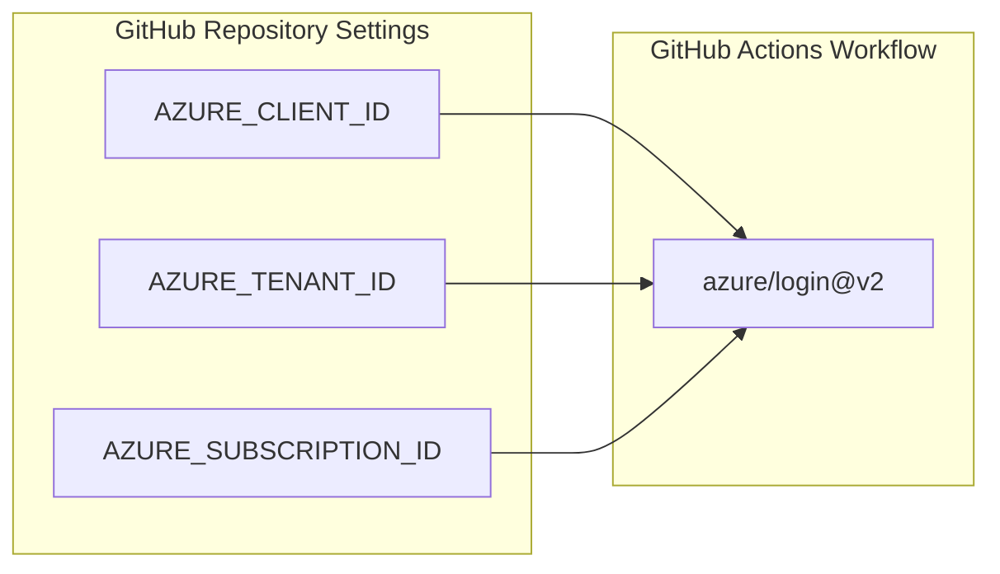

### Manual Steps
1. Set `AZURE_CLIENT_ID` secret
2. Set `AZURE_TENANT_ID` secret
3. Set `AZURE_SUBSCRIPTION_ID` secret

### Commands

```powershell
# Set AZURE_CLIENT_ID
gh secret set AZURE_CLIENT_ID --body "<APP_CLIENT_ID>" --repo <owner>/html-webapp

# Set AZURE_TENANT_ID
gh secret set AZURE_TENANT_ID --body "<TENANT_ID>" --repo <owner>/html-webapp

# Set AZURE_SUBSCRIPTION_ID
gh secret set AZURE_SUBSCRIPTION_ID --body "<SUBSCRIPTION_ID>" --repo <owner>/html-webapp

# Verify secrets are set
gh secret list --repo <owner>/html-webapp
```

### Actual Commands Used

```powershell
gh secret set AZURE_CLIENT_ID --body "6fc9b46f-3854-4053-a8a5-b66e10eccc06" --repo kalal-shivakumar/html-webapp
gh secret set AZURE_TENANT_ID --body "a87d418a-4991-4593-b472-b6ede0e96c60" --repo kalal-shivakumar/html-webapp
gh secret set AZURE_SUBSCRIPTION_ID --body "eea9ffc5-6c64-4dab-b152-3d2f49a73ff1" --repo kalal-shivakumar/html-webapp
```

---

## Stage 7: Create GitHub Actions Workflow

### What this does
Creates a CI/CD pipeline that automatically deploys the app to Azure whenever code is pushed to the `master` branch.

### Workflow Architecture

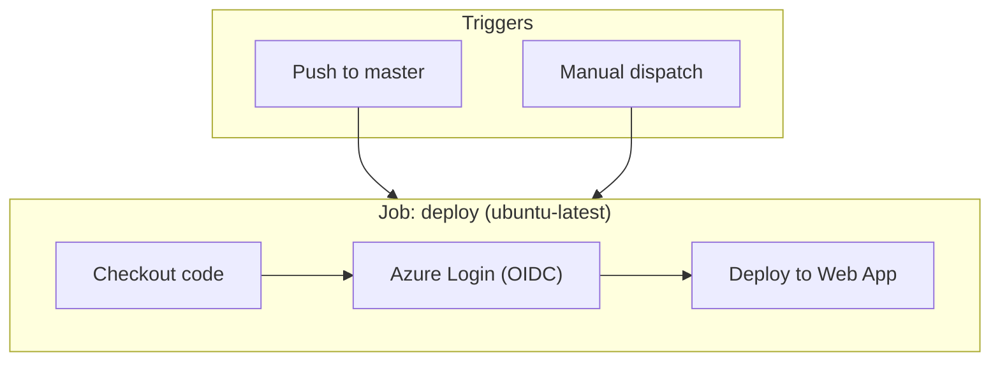

### Manual Steps
1. Create `.github/workflows/` directory
2. Create `deploy.yml` workflow file
3. Commit and push

### File: `.github/workflows/deploy.yml`

```yaml
name: Deploy to Azure App Service

on:
  push:
    branches:
      - master
  workflow_dispatch:

permissions:
  id-token: write
  contents: read

jobs:
  deploy:
    runs-on: ubuntu-latest

    steps:
      - name: Checkout code
        uses: actions/checkout@v4

      - name: Login to Azure
        uses: azure/login@v2
        with:
          client-id: ${{ secrets.AZURE_CLIENT_ID }}
          tenant-id: ${{ secrets.AZURE_TENANT_ID }}
          subscription-id: ${{ secrets.AZURE_SUBSCRIPTION_ID }}

      - name: Deploy to Azure Web App
        uses: azure/webapps-deploy@v3
        with:
          app-name: html-webapp-kalal
          package: .
```

### Key Configuration Explained

| Setting | Purpose |
|---------|---------|
| `permissions.id-token: write` | Required for OIDC token generation |
| `permissions.contents: read` | Required for checkout |
| `azure/login@v2` | Handles OIDC authentication to Azure |
| `azure/webapps-deploy@v3` | Deploys files to Azure App Service |
| `workflow_dispatch` | Allows manual trigger from GitHub UI |

### Commands

```powershell
# Create workflow directory and file
mkdir -p .github/workflows

# (Create deploy.yml with content above)

# Commit and push
git add .github/
git commit -m "Add GitHub Actions deploy workflow"
git push origin master
```

---

## Stage 8: Run the Workflow

### What this does
The workflow runs automatically on push to `master`. You can also trigger it manually or monitor its status.

### Commands

```powershell
# List recent workflow runs
gh run list --repo kalal-shivakumar/html-webapp --limit 5

# Watch a workflow run in real-time
gh run watch --repo kalal-shivakumar/html-webapp --exit-status

# Manually trigger the workflow
gh workflow run deploy.yml --repo kalal-shivakumar/html-webapp --ref master

# View workflow run logs
gh run view <RUN_ID> --repo kalal-shivakumar/html-webapp --log
```

### Successful Run Output

```
✓ master Deploy to Azure App Service · 28079008465
Triggered via push about 1 minute ago

JOBS
✓ deploy in 27s (ID 83129408851)
  ✓ Set up job
  ✓ Checkout code
  ✓ Login to Azure
  ✓ Deploy to Azure Web App
  ✓ Post Login to Azure
  ✓ Post Checkout code
  ✓ Complete job
```

---

## End-to-End Architecture

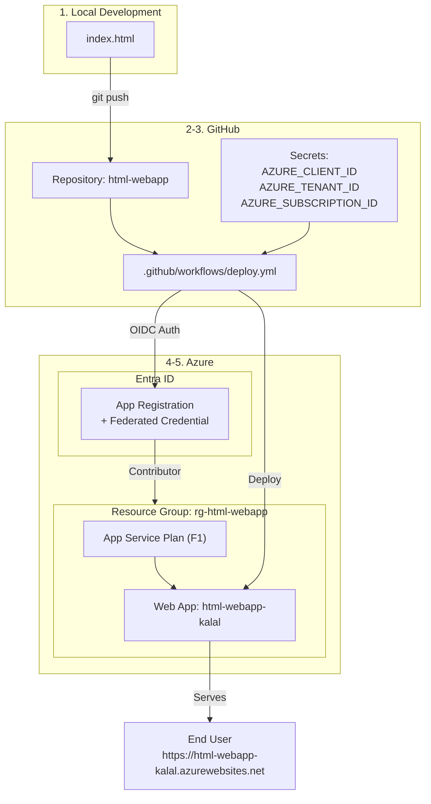

---

## Quick Reference - All Commands

```powershell
# === STAGE 1: Create Project ===
mkdir HTML-WebApp && cd HTML-WebApp
# Create index.html

# === STAGE 2: Git & GitHub ===
git init
git add .
git commit -m "Initial commit: add index.html"
gh repo create html-webapp --public --source=. --remote=origin --push

# === STAGE 3: Resource Group ===
az group create --name rg-html-webapp --location centralus

# === STAGE 4: App Service ===
az appservice plan create --name asp-html-webapp --resource-group rg-html-webapp --sku F1 --location centralus
az webapp create --name html-webapp-kalal --resource-group rg-html-webapp --plan asp-html-webapp

# === STAGE 5: App Registration + Federated Credential ===
az ad app create --display-name "html-webapp-github-deploy"
az ad sp create --id <APP_ID>
az role assignment create --assignee <APP_ID> --role Contributor --scope /subscriptions/<SUB_ID>/resourceGroups/rg-html-webapp
az ad app federated-credential create --id <APP_OBJECT_ID> --parameters @fedcred.json

# === STAGE 6: GitHub Secrets ===
gh secret set AZURE_CLIENT_ID --body "<value>" --repo <owner>/html-webapp
gh secret set AZURE_TENANT_ID --body "<value>" --repo <owner>/html-webapp
gh secret set AZURE_SUBSCRIPTION_ID --body "<value>" --repo <owner>/html-webapp

# === STAGE 7: Workflow ===
# Create .github/workflows/deploy.yml
git add .github/
git commit -m "Add GitHub Actions deploy workflow"
git push origin master

# === STAGE 8: Run & Monitor ===
gh run list --repo <owner>/html-webapp
gh run watch --repo <owner>/html-webapp --exit-status
```

---

## Cleanup

To remove all resources when no longer needed:

```powershell
# Delete Azure resources
az group delete --name rg-html-webapp --yes --no-wait

# Delete App Registration
az ad app delete --id 6fc9b46f-3854-4053-a8a5-b66e10eccc06

# Delete GitHub repo (optional)
gh repo delete kalal-shivakumar/html-webapp --yes
```

---

## Troubleshooting

| Issue | Solution |
|-------|----------|
| Quota error on App Service Plan | Try a different region (`centralus`, `westus2`, `northeurope`) |
| Federated credential JSON error in PowerShell | Write JSON to a file and use `@filename.json` syntax |
| Workflow fails on Login | Verify secrets match app registration values |
| Workflow fails on Deploy | Ensure service principal has Contributor role on the resource group |
| 403 on OIDC token | Check federated credential subject matches `repo:<owner>/<repo>:ref:refs/heads/<branch>` |
