# HTML Web App - Azure App Service Deployment with GitHub Actions

A simple HTML web application deployed to Azure App Service using GitHub Actions with OIDC (OpenID Connect) federated credentials for passwordless authentication.

---

## Architecture Overview

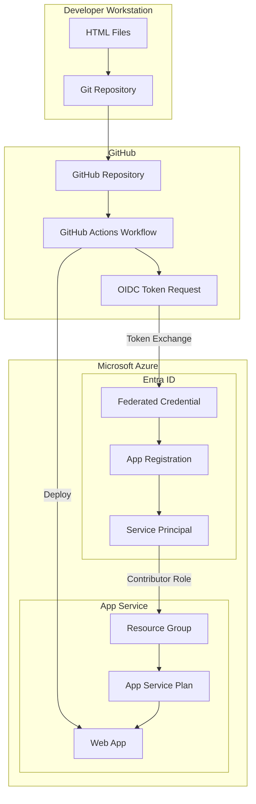

---

## Deployment Flow

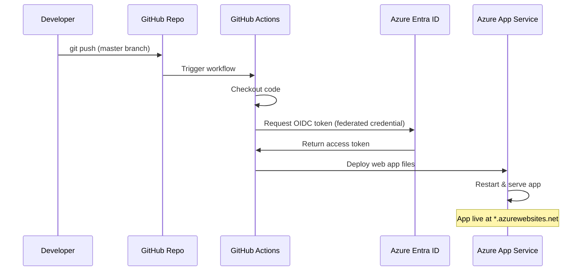

---

## Prerequisites

- [Git](https://git-scm.com/downloads) installed
- [Azure CLI](https://learn.microsoft.com/en-us/cli/azure/install-azure-cli) installed and logged in
- [GitHub CLI (gh)](https://cli.github.com/) installed and authenticated
- An active Azure subscription
- A GitHub account

---

## Stage 1: Create Project Folder and HTML Files

### What this does
Creates the project directory and a basic HTML file that will be served by Azure App Service.

### Manual Steps
1. Create a new folder for the project
2. Create an `index.html` file with basic HTML content

### Commands

```powershell
# Create project directory
mkdir C:\Users\P9202728\HTML-WebApp
cd C:\Users\P9202728\HTML-WebApp
```

### File: `index.html`

```html
<!DOCTYPE html>
<html lang="en">
<head>
    <meta charset="UTF-8">
    <meta name="viewport" content="width=device-width, initial-scale=1.0">
    <title>HTML Web App</title>
    <style>
        body {
            font-family: Arial, sans-serif;
            display: flex;
            justify-content: center;
            align-items: center;
            min-height: 100vh;
            margin: 0;
            background-color: #f0f0f0;
        }
        .container {
            text-align: center;
            padding: 2rem;
            background: white;
            border-radius: 8px;
            box-shadow: 0 2px 10px rgba(0,0,0,0.1);
        }
        h1 { color: #333; }
        p { color: #666; }
    </style>
</head>
<body>
    <div class="container">
        <h1>Hello, Azure!</h1>
        <p>This is a simple HTML web application deployed to Azure App Service.</p>
    </div>
</body>
</html>
```

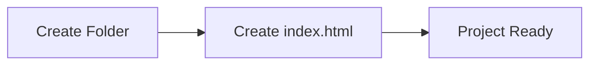

---

## Stage 2: GitHub Repository Creation & Git Commands

### What this does
Initializes a local Git repository, commits the code, creates a remote GitHub repository, and pushes the code.

### Manual Steps
1. Initialize Git in the project folder
2. Stage all files
3. Create initial commit
4. Create a GitHub repository using `gh` CLI
5. Push code to GitHub

### Commands

```powershell
# Initialize git repository
git init

# Stage all files
git add .

# Create initial commit
git commit -m "Initial commit: add index.html"

# Create GitHub repo and push (using gh CLI)
# This creates the repo, sets the remote, and pushes in one command
gh repo create html-webapp --public --source=. --remote=origin --push
```

### Alternative (Manual Remote Setup)

```powershell
# If you already have a GitHub repo created via the web UI:
git remote add origin https://github.com/<username>/html-webapp.git
git branch -M master
git push -u origin master
```

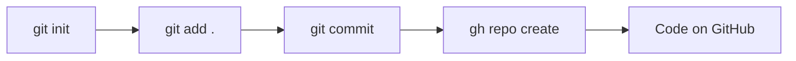

### Output
- Repository: `https://github.com/kalal-shivakumar/html-webapp`
- Branch: `master`

---

## Stage 3: Azure Resource Group Creation

### What this does
Creates an Azure Resource Group to logically group all related resources (App Service Plan, Web App).

### Architecture

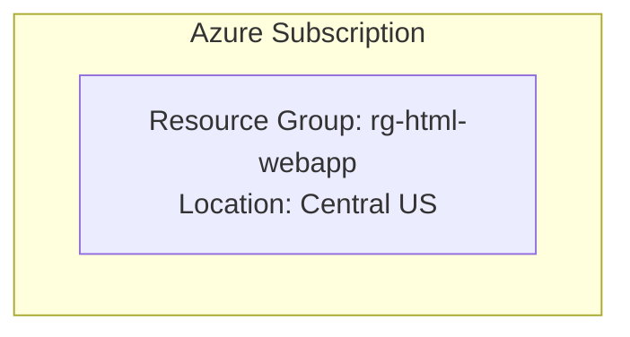

### Manual Steps
1. Log in to Azure CLI
2. Create a resource group in your preferred region

### Commands

```powershell
# Verify Azure login
az account show --output table

# Create resource group
az group create --name rg-html-webapp --location centralus --output table
```

### Parameters
| Parameter | Value | Description |
|-----------|-------|-------------|
| `--name` | `rg-html-webapp` | Resource group name |
| `--location` | `centralus` | Azure region |

---

## Stage 4: App Service Plan & Web App

### What this does
Creates an App Service Plan (the compute infrastructure) and a Web App (the application endpoint) to host the static HTML site.

### Architecture

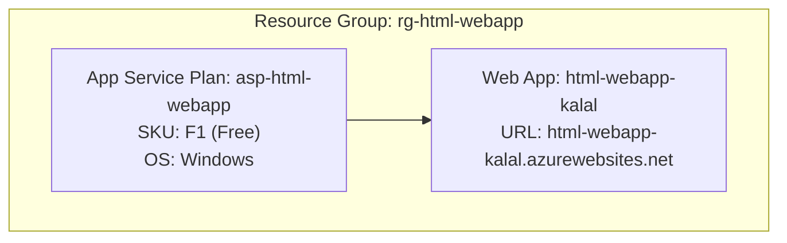

### Manual Steps
1. Create an App Service Plan (Free tier)
2. Create a Web App on that plan

### Commands

```powershell
# Create App Service Plan (Free tier, Windows, Central US)
az appservice plan create \
    --name asp-html-webapp \
    --resource-group rg-html-webapp \
    --sku F1 \
    --location centralus \
    --output table

# Create the Web App
az webapp create \
    --name html-webapp-kalal \
    --resource-group rg-html-webapp \
    --plan asp-html-webapp \
    --output table
```

### Parameters
| Parameter | Value | Description |
|-----------|-------|-------------|
| App Service Plan | `asp-html-webapp` | Compute plan name |
| SKU | `F1` | Free tier (60 min/day CPU) |
| Web App Name | `html-webapp-kalal` | Globally unique app name |
| URL | `https://html-webapp-kalal.azurewebsites.net` | Public endpoint |

> **Note:** If you encounter quota errors in `eastus`, try `centralus` or another region.

---

## Stage 5: App Registration & Federated Credentials

### What this does
Creates an Entra ID (Azure AD) App Registration with a federated credential that allows GitHub Actions to authenticate to Azure without storing secrets — using OpenID Connect (OIDC).

### Architecture

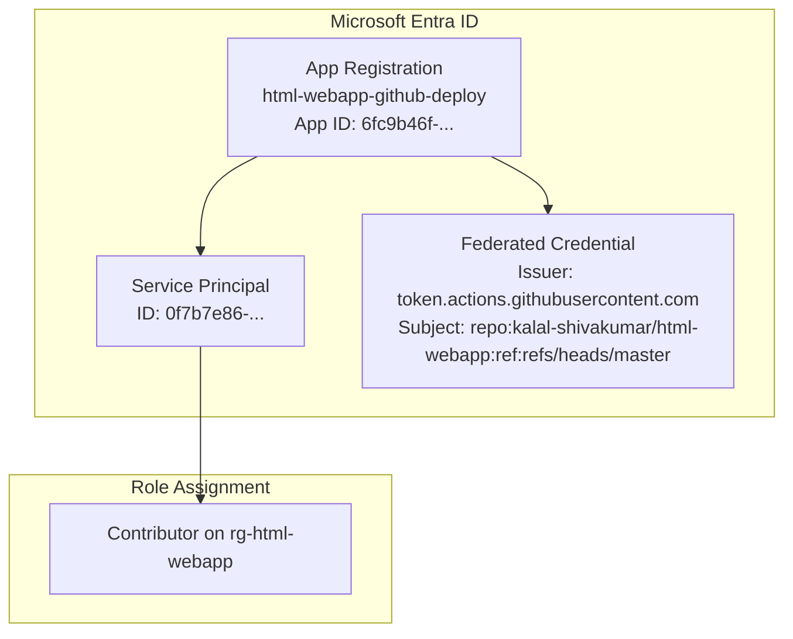

### OIDC Flow Diagram

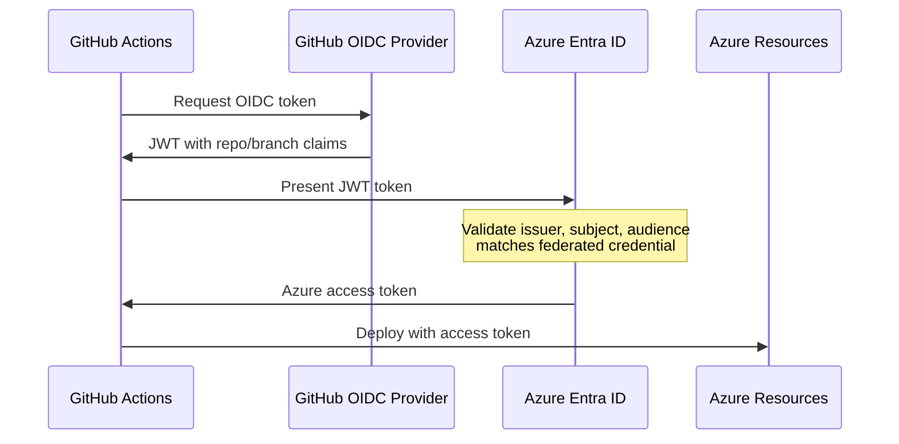

### Manual Steps
1. Create an App Registration
2. Create a Service Principal
3. Assign Contributor role on the resource group
4. Create a federated credential for GitHub Actions

### Commands

```powershell
# Step 1: Create App Registration
az ad app create --display-name "html-webapp-github-deploy" --query "{appId: appId, id: id}" --output json
# Note the appId and id (object ID) from the output

# Step 2: Create Service Principal
az ad sp create --id <APP_ID> --query "{id: id, appId: appId}" --output json

# Step 3: Assign Contributor role to the service principal on the resource group
az role assignment create \
    --assignee <APP_ID> \
    --role Contributor \
    --scope /subscriptions/<SUBSCRIPTION_ID>/resourceGroups/rg-html-webapp \
    --output table

# Step 4: Create federated credential (use a JSON file to avoid quoting issues)
```

### Federated Credential JSON (`fedcred.json`)

```json
{
    "name": "github-deploy-master",
    "issuer": "https://token.actions.githubusercontent.com",
    "subject": "repo:kalal-shivakumar/html-webapp:ref:refs/heads/master",
    "audiences": ["api://AzureADTokenExchange"]
}
```

```powershell
# Create the federated credential from file
az ad app federated-credential create \
    --id <APP_OBJECT_ID> \
    --parameters @fedcred.json \
    --output table
```

### Values to Note

| Secret | Value | Description |
|--------|-------|-------------|
| `AZURE_CLIENT_ID` | `6fc9b46f-3854-4053-a8a5-b66e10eccc06` | App Registration Application (client) ID |
| `AZURE_TENANT_ID` | `a87d418a-4991-4593-b472-b6ede0e96c60` | Azure AD Tenant ID |
| `AZURE_SUBSCRIPTION_ID` | `eea9ffc5-6c64-4dab-b152-3d2f49a73ff1` | Azure Subscription ID |

---

## Stage 5.1: Generate Federated Credentials via Azure Portal (Step-by-Step GUI Guide)

This section explains how to create federated credentials directly from the **Azure Portal** inside the App Registration's **Certificates & secrets** section.

### Step-by-Step Instructions

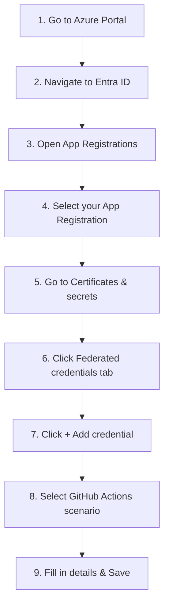

#### Step 1: Navigate to App Registrations

1. Go to [https://portal.azure.com](https://portal.azure.com)
2. In the top search bar, type **"App registrations"** and select it
3. Click on your app registration (e.g., `html-webapp-github-deploy`)
   - If you don't have one yet, click **+ New registration**, enter a name, and click **Register**

#### Step 2: Open Certificates & secrets

1. In the left sidebar menu of your App Registration, click **Certificates & secrets**
2. You will see three tabs:
   - **Certificates** — for certificate-based auth
   - **Client secrets** — for secret-based auth (NOT recommended for GitHub Actions)
   - **Federated credentials** — for OIDC passwordless auth ✅

#### Step 3: Add a Federated Credential

1. Click the **Federated credentials** tab
2. Click **+ Add credential**

#### Step 4: Select the Federated Credential Scenario

A panel will open asking you to choose a scenario:

| Scenario | Use Case |
|----------|----------|
| **GitHub Actions deploying Azure resources** | ✅ Select this one |
| Kubernetes accessing Azure resources | For AKS workloads |
| Other issuer | Custom OIDC providers |

Select **"GitHub Actions deploying Azure resources"**

#### Step 5: Fill in the GitHub Details

Fill in the following fields:

| Field | Value | Description |
|-------|-------|-------------|
| **Organization** | `kalal-shivakumar` | Your GitHub username or org name |
| **Repository** | `html-webapp` | The repository name (without owner prefix) |
| **Entity type** | `Branch` | Choose Branch, Environment, Tag, or Pull Request |
| **GitHub branch name** | `master` | The branch that triggers deployment |
| **Name** | `github-deploy-master` | A friendly name for this credential |

> **Entity Type Options:**
> - **Branch** — Use when deploying from a specific branch (e.g., `master`, `main`)
> - **Environment** — Use when deploying from a GitHub Environment (e.g., `production`)
> - **Tag** — Use when deploying on tag creation (e.g., `v1.0.0`)
> - **Pull Request** — Use when deploying from PRs (for preview environments)

#### Step 6: Review and Save

1. Review the auto-generated values:
   - **Issuer:** `https://token.actions.githubusercontent.com`
   - **Subject identifier:** `repo:kalal-shivakumar/html-webapp:ref:refs/heads/master`
   - **Audience:** `api://AzureADTokenExchange`
2. Click **Add**

#### Step 7: Verify the Credential

After saving, you'll see your new federated credential listed under the **Federated credentials** tab with:
- Name: `github-deploy-master`
- Issuer: `https://token.actions.githubusercontent.com`
- Subject: `repo:kalal-shivakumar/html-webapp:ref:refs/heads/master`

### Understanding the Subject Identifier Format

The subject identifier tells Azure which specific GitHub workflow is allowed to authenticate:

```
repo:<owner>/<repo>:ref:refs/heads/<branch>        # For branch-based
repo:<owner>/<repo>:environment:<env-name>          # For environment-based
repo:<owner>/<repo>:ref:refs/tags/<tag>             # For tag-based
repo:<owner>/<repo>:pull_request                    # For pull requests
```

### Adding Multiple Federated Credentials

You can add multiple federated credentials for different scenarios:

| Name | Entity Type | Value | Use Case |
|------|-------------|-------|----------|
| `github-deploy-master` | Branch | `master` | Production deployments |
| `github-deploy-develop` | Branch | `develop` | Staging deployments |
| `github-deploy-production` | Environment | `production` | Environment-gated deploys |
| `github-deploy-tags` | Tag | `v*` | Release deployments |

### Important Notes

> ⚠️ **Do NOT create a Client Secret** if you are using Federated Credentials. Federated credentials provide passwordless authentication — no secret rotation needed.

> ⚠️ **Maximum 20 federated credentials** per App Registration.

> ⚠️ **Subject must match exactly** — if your workflow runs on `main` but the credential says `master`, authentication will fail.

### Security Benefits of Federated Credentials vs Client Secrets

| Feature | Client Secrets | Federated Credentials |
|---------|---------------|----------------------|
| Secret stored in GitHub | ✅ Yes (risk) | ❌ No |
| Needs rotation | ✅ Every 6-24 months | ❌ Never |
| Can be leaked in logs | ✅ Possible | ❌ Impossible |
| Scoped to specific repo/branch | ❌ No | ✅ Yes |
| Best practice for CI/CD | ❌ | ✅ |

---

## Stage 6: Adding Secrets to GitHub

### What this does
Stores the Azure authentication values as encrypted secrets in the GitHub repository, which the workflow will use to authenticate.

### Architecture

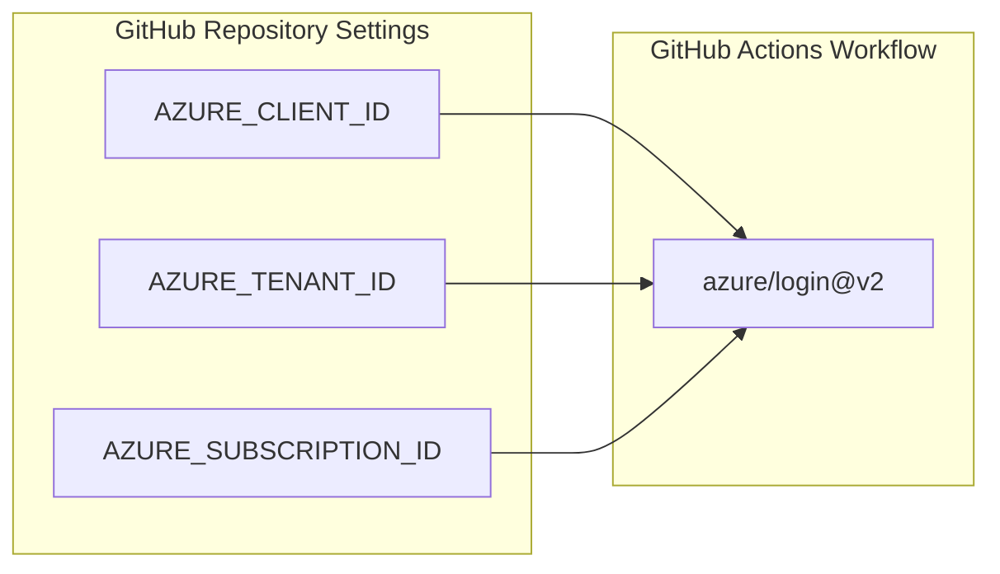

### Manual Steps
1. Set `AZURE_CLIENT_ID` secret
2. Set `AZURE_TENANT_ID` secret
3. Set `AZURE_SUBSCRIPTION_ID` secret

### Commands

```powershell
# Set AZURE_CLIENT_ID
gh secret set AZURE_CLIENT_ID --body "<APP_CLIENT_ID>" --repo <owner>/html-webapp

# Set AZURE_TENANT_ID
gh secret set AZURE_TENANT_ID --body "<TENANT_ID>" --repo <owner>/html-webapp

# Set AZURE_SUBSCRIPTION_ID
gh secret set AZURE_SUBSCRIPTION_ID --body "<SUBSCRIPTION_ID>" --repo <owner>/html-webapp

# Verify secrets are set
gh secret list --repo <owner>/html-webapp
```

### Actual Commands Used

```powershell
gh secret set AZURE_CLIENT_ID --body "6fc9b46f-3854-4053-a8a5-b66e10eccc06" --repo kalal-shivakumar/html-webapp
gh secret set AZURE_TENANT_ID --body "a87d418a-4991-4593-b472-b6ede0e96c60" --repo kalal-shivakumar/html-webapp
gh secret set AZURE_SUBSCRIPTION_ID --body "eea9ffc5-6c64-4dab-b152-3d2f49a73ff1" --repo kalal-shivakumar/html-webapp
```

---

## Stage 7: Create GitHub Actions Workflow

### What this does
Creates a CI/CD pipeline that automatically deploys the app to Azure whenever code is pushed to the `master` branch.

### Workflow Architecture

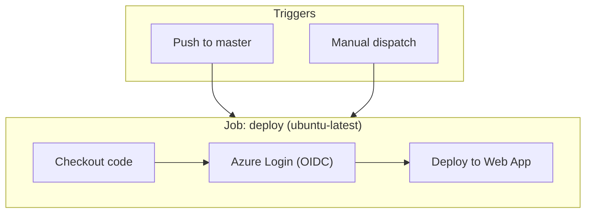

### Manual Steps
1. Create `.github/workflows/` directory
2. Create `deploy.yml` workflow file
3. Commit and push

### File: `.github/workflows/deploy.yml`

```yaml
name: Deploy to Azure App Service

on:
  push:
    branches:
      - master
  workflow_dispatch:

permissions:
  id-token: write
  contents: read

jobs:
  deploy:
    runs-on: ubuntu-latest

    steps:
      - name: Checkout code
        uses: actions/checkout@v4

      - name: Login to Azure
        uses: azure/login@v2
        with:
          client-id: ${{ secrets.AZURE_CLIENT_ID }}
          tenant-id: ${{ secrets.AZURE_TENANT_ID }}
          subscription-id: ${{ secrets.AZURE_SUBSCRIPTION_ID }}

      - name: Deploy to Azure Web App
        uses: azure/webapps-deploy@v3
        with:
          app-name: html-webapp-kalal
          package: .
```

### Key Configuration Explained

| Setting | Purpose |
|---------|---------|
| `permissions.id-token: write` | Required for OIDC token generation |
| `permissions.contents: read` | Required for checkout |
| `azure/login@v2` | Handles OIDC authentication to Azure |
| `azure/webapps-deploy@v3` | Deploys files to Azure App Service |
| `workflow_dispatch` | Allows manual trigger from GitHub UI |

### Commands

```powershell
# Create workflow directory and file
mkdir -p .github/workflows

# (Create deploy.yml with content above)

# Commit and push
git add .github/
git commit -m "Add GitHub Actions deploy workflow"
git push origin master
```

---

## Stage 8: Run the Workflow

### What this does
The workflow runs automatically on push to `master`. You can also trigger it manually or monitor its status.

### Commands

```powershell
# List recent workflow runs
gh run list --repo kalal-shivakumar/html-webapp --limit 5

# Watch a workflow run in real-time
gh run watch --repo kalal-shivakumar/html-webapp --exit-status

# Manually trigger the workflow
gh workflow run deploy.yml --repo kalal-shivakumar/html-webapp --ref master

# View workflow run logs
gh run view <RUN_ID> --repo kalal-shivakumar/html-webapp --log
```

### Successful Run Output

```
✓ master Deploy to Azure App Service · 28079008465
Triggered via push about 1 minute ago

JOBS
✓ deploy in 27s (ID 83129408851)
  ✓ Set up job
  ✓ Checkout code
  ✓ Login to Azure
  ✓ Deploy to Azure Web App
  ✓ Post Login to Azure
  ✓ Post Checkout code
  ✓ Complete job
```

---

## End-to-End Architecture

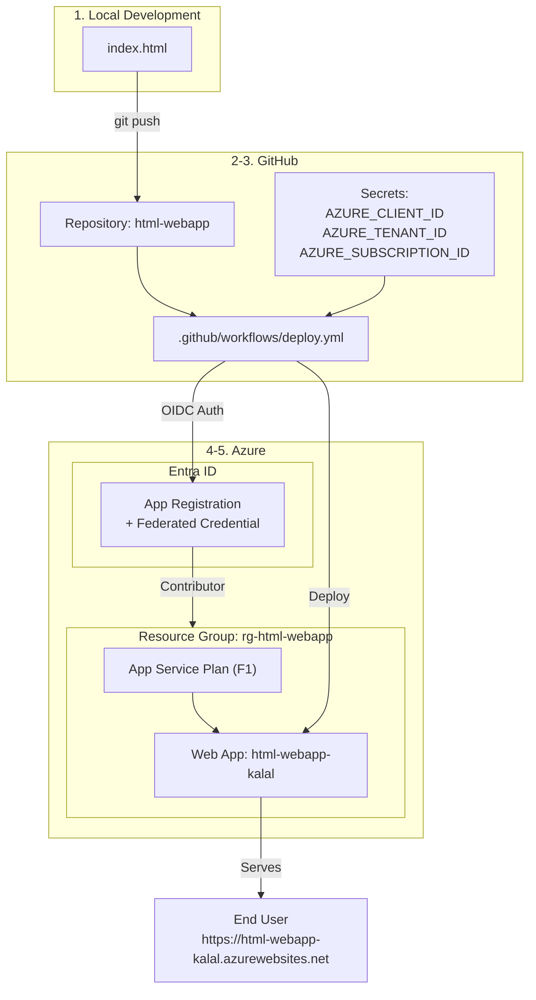

---

## Quick Reference - All Commands

```powershell
# === STAGE 1: Create Project ===
mkdir HTML-WebApp && cd HTML-WebApp
# Create index.html

# === STAGE 2: Git & GitHub ===
git init
git add .
git commit -m "Initial commit: add index.html"
gh repo create html-webapp --public --source=. --remote=origin --push

# === STAGE 3: Resource Group ===
az group create --name rg-html-webapp --location centralus

# === STAGE 4: App Service ===
az appservice plan create --name asp-html-webapp --resource-group rg-html-webapp --sku F1 --location centralus
az webapp create --name html-webapp-kalal --resource-group rg-html-webapp --plan asp-html-webapp

# === STAGE 5: App Registration + Federated Credential ===
az ad app create --display-name "html-webapp-github-deploy"
az ad sp create --id <APP_ID>
az role assignment create --assignee <APP_ID> --role Contributor --scope /subscriptions/<SUB_ID>/resourceGroups/rg-html-webapp
az ad app federated-credential create --id <APP_OBJECT_ID> --parameters @fedcred.json

# === STAGE 6: GitHub Secrets ===
gh secret set AZURE_CLIENT_ID --body "<value>" --repo <owner>/html-webapp
gh secret set AZURE_TENANT_ID --body "<value>" --repo <owner>/html-webapp
gh secret set AZURE_SUBSCRIPTION_ID --body "<value>" --repo <owner>/html-webapp

# === STAGE 7: Workflow ===
# Create .github/workflows/deploy.yml
git add .github/
git commit -m "Add GitHub Actions deploy workflow"
git push origin master

# === STAGE 8: Run & Monitor ===
gh run list --repo <owner>/html-webapp
gh run watch --repo <owner>/html-webapp --exit-status
```

---

## Cleanup

To remove all resources when no longer needed:

```powershell
# Delete Azure resources
az group delete --name rg-html-webapp --yes --no-wait

# Delete App Registration
az ad app delete --id 6fc9b46f-3854-4053-a8a5-b66e10eccc06

# Delete GitHub repo (optional)
gh repo delete kalal-shivakumar/html-webapp --yes
```

---

## Troubleshooting

| Issue | Solution |
|-------|----------|
| Quota error on App Service Plan | Try a different region (`centralus`, `westus2`, `northeurope`) |
| Federated credential JSON error in PowerShell | Write JSON to a file and use `@filename.json` syntax |
| Workflow fails on Login | Verify secrets match app registration values |
| Workflow fails on Deploy | Ensure service principal has Contributor role on the resource group |
| 403 on OIDC token | Check federated credential subject matches `repo:<owner>/<repo>:ref:refs/heads/<branch>` |
